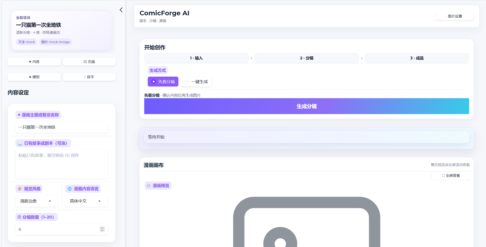
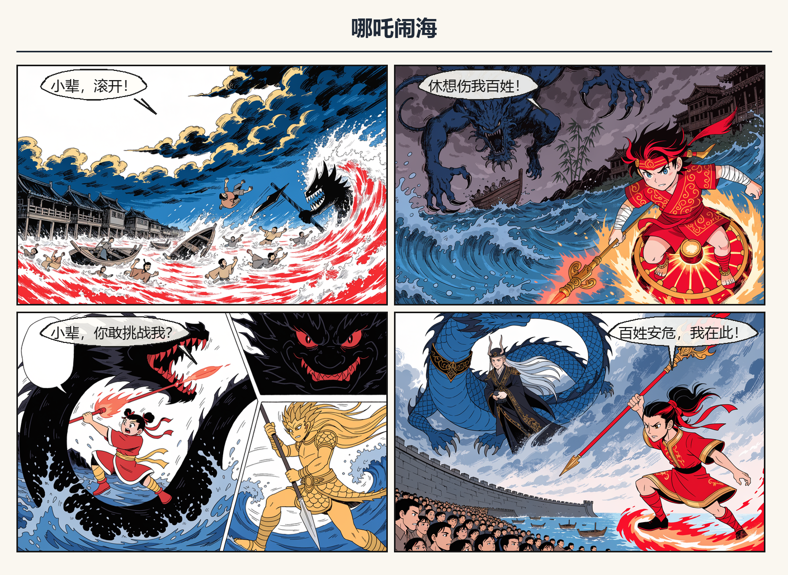
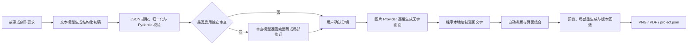

# ComicForge AI

> 一个将故事创作、剧本审查、结构化分镜、多模型生图、本地排字与漫画导出整合到同一工作流中的 AI 辅助漫画制作平台。



ComicForge AI 基于 **Python 3.11** 和 **Gradio** 开发。用户可以分别选择文本创作模型、剧本审查模型和图片生成模型，把自然语言故事转换为可检查、可编辑、可追溯的漫画项目。

项目可以在不配置 API Key、不安装本地大模型的情况下，通过内置 Mock Provider 完成离线演示。Ollama、ComfyUI 和各云端 API 均为可选能力，由使用者按需配置。

## 目录

- [最快启动](#最快启动)
- [第一次使用](#第一次使用)
- [主要功能](#主要功能)
- [系统工作流程](#系统工作流程)
- [Provider 支持状态](#provider-支持状态)
- [配置真实模型](#配置真实模型)
- [输出文件与项目重载](#输出文件与项目重载)
- [项目结构](#项目结构)
- [测试与开发命令](#测试与开发命令)
- [常见问题](#常见问题)
- [当前限制](#当前限制)
- [文档导航](#文档导航)

## 最快启动

### 环境要求

- Python `>=3.11,<3.12`，推荐 Python 3.11 64 位
- Windows、macOS 或 Linux
- 建议至少预留 2 GB 磁盘空间用于 Python 环境；本地模型需要额外空间

### Windows PowerShell

在项目根目录依次执行：

```powershell
py -3.11 -m venv .venv
.\.venv\Scripts\python.exe -m pip install --upgrade pip
.\.venv\Scripts\python.exe -m pip install -r requirements.txt
.\.venv\Scripts\python.exe app.py
```

浏览器访问：<http://127.0.0.1:7860>

### macOS / Linux

```bash
python3.11 -m venv .venv
./.venv/bin/python -m pip install --upgrade pip
./.venv/bin/python -m pip install -r requirements.txt
./.venv/bin/python app.py
```

浏览器访问：<http://127.0.0.1:7860>

> 首次运行不需要创建 `.env`。进入前端后选择 **Mock Text** 和 **Mock Image**，即可在无网络、无 API Key、无本地模型的情况下验证完整流程。

如果使用 Git 获取项目：

```powershell
git clone https://github.com/simonwang0207-lab/ComicForge-AI.git
Set-Location ComicForge-AI
```

如果收到的是 ZIP 压缩包，解压后在包含 `app.py` 的目录打开终端，再执行上述安装命令。

## 第一次使用

启动前端后，建议先完成一次无费用验证：

1. 在“文本创作模型”中选择 **Mock Text**。
2. 在“剧本审查模型”中选择 **不审查**或 Mock。
3. 在“图片模型”中选择 **Mock Image**。
4. 输入故事主题，例如“哪吒在东海保护渔民”。
5. 选择漫画格数、内容语言和布局模式。
6. 先生成剧本和分镜，检查结构化结果。
7. 确认后生成图片，查看漫画预览。
8. 下载 PNG、PDF 或项目 JSON。

这次验证可以确认 Python 环境、依赖、前端、分镜、排字、布局和文件导出均能正常工作，但不代表任何外部 API 或本地模型已经配置成功。



## 主要功能

### 剧本设计与审查

- 输入主题、自然语言创作要求或已有故事。
- 生成标题候选、故事梗概、角色设定和 Story Bible。
- 生成每格的场景、动作、角色、构图、子镜头和英文图片 Prompt。
- 结构化保存对白、思考、旁白和拟声词。
- 文本创作模型与剧本审查模型可以独立选择。
- 审查失败或修订稿无法安全合并时，保留已经通过校验的初稿，不阻断后续生图。
- 对模型 JSON 进行代码块提取、字段归一化、有限修复和 Pydantic 校验。
- 前端支持 1–20 格创作，核心服务不固定为四格或八格。

### 图片生成与角色参考

- 文本 Provider 与图片 Provider 独立组合。
- 支持 Mock、云端图片 API 和本地 ComfyUI 工作流。
- 按分格角色筛选参考图，并记录实际使用的角色和参考图数量。
- 支持参考图批量导入、剪贴板粘贴、顺序展示和拖动排序。
- 使用参考图时，最终 Prompt 优先保持参考人物的脸、发型、服装和配色，只改变动作、表情、场景与镜头。
- 支持单格重新生成、旧版本归档和回退，避免整页重新生成。
- 每格记录实际 Provider、模型、Prompt、尺寸、耗时、request ID、seed、错误和 fallback 状态。

### 本地排字、布局与导出

- 图片模型只生成无字画面；漫画文字由 Pillow 在本地绘制。
- 支持对白气泡、思想气泡、旁白框和拟声词。
- 支持中文换行、气泡尾巴、文字锚点、预留区域和基础避让。
- 支持传统漫画页、规则网格、竖向条漫和自定义画框。
- 全屏预览支持滚轮缩放、左键拖动画布和双击复位。
- 导出最终漫画 PNG、单页 PDF 和完整 `project.json`。
- 可重新载入项目 JSON，继续查看、修改或局部生成。

## 系统工作流程



付费图片生成与剧本设计是分开的。使用者可以先用文本模型完成并检查分镜，再决定是否调用收费图片 Provider。

## Provider 支持状态

状态定义：

- **已实现/注册**：代码适配器存在，已经加入注册表和前端选项。
- **已真实验收**：真实 API 或本地工作流曾返回有效结果，且没有发生 Mock 回退。
- **使用者需配置**：仓库不包含密钥、账户余额、本地模型权重或正在运行的模型服务。

### 文本 Provider

| Provider | 已实现/注册 | 项目现有验收记录 | 新环境要求 |
|---|:---:|---|---|
| Mock Text | ✅ | 离线闭环已验证 | 无 |
| Ollama | ✅ | 本机 `qwen3:4b` 有真实生成记录 | 安装并启动 Ollama，下载模型 |
| OpenAI-compatible | ✅ | 有真实生成和审查记录 | 兼容 Chat Completions 的服务、Key 和模型 ID |
| DeepSeek | ✅ | 有真实调用记录 | DeepSeek 或兼容服务的 Key 和模型 ID |

### 图片 Provider

| Provider | 已实现/注册 | 项目现有验收记录 | 新环境要求 |
|---|:---:|---|---|
| Mock Image | ✅ | 离线闭环已验证 | 无 |
| Gemini Image | ✅ | 无参考图、参考图及四格项目均有真实生成记录 | Gemini 或兼容网关的 Key、协议模式和模型 ID |
| Recraft | ✅ | 多次真实手测和四格无回退记录 | Recraft API Key |
| ComfyUI | ✅ | 严格单图及多格无回退记录 | ComfyUI、模型权重、自定义节点和 API Workflow |
| SiliconFlow | ✅ | 已验证鉴权、模型列表和目标模型存在；尚未完成收费生图验收 | API Key、正确区域端点和可用余额 |
| OpenAI Images | ✅ | 尚未真实验收 | API Key、可用图片模型和余额 |
| Together | ✅ | 仅完成代码适配和离线协议测试 | API Key、模型 ID 和余额 |
| fal | ✅ | 仅完成代码适配和离线队列测试 | API Key、模型 ID 和余额 |

> 上表描述的是项目开发阶段已有证据，不保证另一台电脑上的外部服务自动可用。新使用者只要完成 Python 依赖安装即可运行程序；真实 Provider 是否可用取决于自己的配置。

## 配置真实模型

### 配置文件规则

真实模型是可选项。需要时先复制配置模板：

```powershell
Copy-Item .env.example .env
```

macOS / Linux：

```bash
cp .env.example .env
```

然后使用文本编辑器修改项目根目录下的 `.env`。修改后必须停止并重新启动 `app.py`，前端选项和状态才会刷新。

安全要求：

- `.env.example` 只保存变量名和安全默认值，可以提交。
- `.env` 保存个人密钥和本机配置，已经被 Git 忽略，不应发送给其他人。
- 不要把真实 Key 写入代码、README、截图、测试或终端日志。
- 不要提交 `outputs/`、模型权重或包含敏感信息的项目记录。

### 通用运行配置

```dotenv
COMICFORGE_OUTPUT_DIR=outputs
COMICFORGE_SERVER_NAME=127.0.0.1
COMICFORGE_SERVER_PORT=7860

TEXT_MODEL_FALLBACK_TO_MOCK=true
IMAGE_MODEL_FALLBACK_TO_MOCK=true
IMAGE_PANEL_CONCURRENCY=1
```

如果端口 7860 被占用，可以改为其他空闲端口，例如 `7861`。

### Ollama 本地文本模型

先在系统中安装 Ollama，然后执行：

```powershell
ollama serve
ollama pull qwen3:4b
```

`.env`：

```dotenv
OLLAMA_BASE_URL=http://127.0.0.1:11434
OLLAMA_MODEL=qwen3:4b
OLLAMA_GENERATION_TIMEOUT=300
OLLAMA_REVIEW_TIMEOUT=90
```

Ollama 与 ComfyUI 可能同时占用显存。项目可在切换到本地生图前尝试释放 Ollama 模型，但实际显存仍取决于使用者的硬件和模型。

### OpenAI-compatible 文本接口

适用于提供 OpenAI Chat Completions 兼容协议的服务：

```dotenv
OPENAI_COMPATIBLE_BASE_URL=
OPENAI_COMPATIBLE_API_KEY=
OPENAI_COMPATIBLE_MODEL=
OPENAI_COMPATIBLE_MAX_TOKENS=4096
```

不同兼容服务对模型名、结构化输出、thinking 参数和 token 上限的支持不同，应以服务商文档为准。

### DeepSeek 文本接口

```dotenv
DEEPSEEK_BASE_URL=https://api.deepseek.com
DEEPSEEK_API_KEY=
DEEPSEEK_MODEL=deepseek-v4-flash
DEEPSEEK_MAX_TOKENS=32768
DEEPSEEK_MAX_RETRY_TOKENS=65536
```

如果账户实际提供的模型 ID 不同，请使用控制台或模型列表返回的完整 ID，不要凭展示名称猜测。

### Gemini 图片接口

项目支持官方 Gemini 路线，也支持实现相同协议的兼容网关。协议模式必须与服务端一致：

```dotenv
GEMINI_API_KEY=
GEMINI_BASE_URL=https://generativelanguage.googleapis.com/v1beta
GEMINI_API_MODE=interactions
GEMINI_IMAGE_MODEL=gemini-3.1-flash-image
GEMINI_IMAGE_SIZE=1K
GEMINI_GENERATION_TIMEOUT=300
GEMINI_MAX_RETRIES=0
```

使用 Gemini-compatible `generateContent` 网关时：

```dotenv
GEMINI_API_MODE=generate-content
GEMINI_GENERATE_CONTENT_CONFIG_MODE=image-config
```

模型名称必须使用服务端模型列表返回的完整 ID。按次计费服务建议保持 `GEMINI_MAX_RETRIES=0`，防止不确定的重复扣费。

### Recraft 图片接口

```dotenv
RECRAFT_API_KEY=
RECRAFT_MODEL=recraftv4_1
RECRAFT_IMAGE_ENDPOINT=https://external.api.recraft.ai/v1/images/generations
```

### ComfyUI 本地图片工作流

源码包可以在没有 ComfyUI 的情况下正常启动；只有选择 ComfyUI Provider 时才需要以下外部环境：

1. 安装并启动 ComfyUI。
2. 安装所选 Workflow 引用的 checkpoint。
3. 如果 Workflow 使用 IPAdapter，安装对应自定义节点、IPAdapter 模型和 CLIP Vision 权重。
4. 从 ComfyUI 导出 **API Format** Workflow JSON；普通界面 Workflow JSON 不能直接提交到 `/prompt`。
5. 核对 JSON 中 prompt、宽度、高度、seed、negative prompt 和参考图节点 ID。

先确认服务可访问：

```powershell
Invoke-RestMethod http://127.0.0.1:8188/system_stats
```

`.env` 示例：

```dotenv
COMFYUI_BASE_URL=http://127.0.0.1:8188
COMFYUI_WORKFLOW_PATH=workflows/comfyui_text2img_api.json
COMFYUI_MODEL=animagine-xl-4.0-ipadapter
COMFYUI_PROMPT_NODE_ID=6
COMFYUI_WIDTH_NODE_ID=5
COMFYUI_HEIGHT_NODE_ID=5
COMFYUI_SEED_NODE_ID=3
COMFYUI_NEGATIVE_PROMPT_NODE_ID=
COMFYUI_REFERENCE_IMAGE_NODE_ID=
IMAGE_MODEL_MAX_POLL_SECONDS=300
```

仓库中的 Workflow 是接口模板，不包含大型模型权重。换用其他 Workflow 时，模型名和节点 ID 通常也需要一起修改。

### 其他图片 Provider

完整变量均列在 [`.env.example`](.env.example) 中：

| Provider | 关键变量 |
|---|---|
| OpenAI Images | `OPENAI_IMAGE_BASE_URL`、`OPENAI_IMAGE_API_KEY`、`OPENAI_IMAGE_MODEL` |
| SiliconFlow | `SILICONFLOW_API_KEY`、`SILICONFLOW_MODEL`、`SILICONFLOW_IMAGE_ENDPOINT` |
| Together | `TOGETHER_API_KEY`、`TOGETHER_MODEL`、`TOGETHER_IMAGE_ENDPOINT` |
| fal | `FAL_KEY`、`FAL_MODEL`、`FAL_BASE_URL` |

只有代码适配或配置检测成功，不等于真实生图验收。首次接入建议先生成一张低风险测试图，再开始多格任务。

## 输出文件与项目重载

每次完整生成通常会创建：

```text
outputs/<时间_主题>/
├── panel_01.png
├── panel_02.png
├── ...
├── panel_versions/       # 单格重新生成前的历史版本
├── comic.png             # 最终漫画 PNG
├── comic.pdf             # 漫画 PDF
└── project.json          # 项目结构、分镜和生成溯源
```

`project.json` 可用于重新加载项目，包含：

- 故事、角色、Story Bible 和分镜；
- 每格最终图片 Prompt；
- 参考角色名称和参考图数量；
- 请求与实际 Provider、模型、耗时和 request ID；
- 图片相对路径、尺寸、seed、错误和 fallback 状态。

项目记录不会保存 API Key，也不会嵌入完整图片 Base64。移动项目输出时，应整体移动对应输出目录，避免相对图片路径失效。

## 项目结构

```text
ComicForge-AI/
├── app.py                         # Gradio 应用入口
├── pyproject.toml                 # Python 包、版本和依赖声明
├── requirements.txt               # 直接安装依赖列表
├── .env.example                   # 无密钥的配置模板
├── src/comicforge_ai/
│   ├── ui.py                      # 界面、状态展示和回调连接
│   ├── service.py                 # 文本、审查、生图、保存和局部重生成编排
│   ├── schemas.py                 # Pydantic 核心数据模型
│   ├── models/                    # 文本/图片 Provider、注册表、HTTP 和错误类型
│   ├── prompts/                   # 剧本、审查、修复和图片 Prompt 模板
│   ├── bubble_renderer.py         # 本地漫画文字与气泡绘制
│   └── layout.py                  # 页面布局、组合和导出
├── workflows/                     # ComfyUI API Workflow 与备份
├── scripts/                       # 预览和 Provider smoke test
├── tests/                         # 不访问真实 API 的自动化测试
├── docs/                          # 成果、技术、演进、模型、Provider 和 Demo 文档
├── TASKS.md                       # 已完成任务和后续优先级
└── AGENTS.md                      # 项目开发约束
```

### 核心设计原则

- 文本模型统一实现 `TextModelProvider`，通过 `TextModelRegistry` 注册。
- 图片模型统一实现 `ImageProvider`，通过 `ImageProviderRegistry` 注册。
- UI 不写死模型厂商；文本创作、审查和图片模型可独立切换。
- Provider 的 URL、鉴权、请求体和响应解析只存在于对应适配器中。
- 模型输出只能通过安全 JSON 工具和 Pydantic 解析，不执行模型返回内容。
- 每次只向图片 Provider 发送一格的视觉 Prompt；漫画文字和整页排版由本地程序完成。
- Provider 失败、Mock 回退和审查未应用必须在界面与项目记录中可见。

## 测试与开发命令

### 安装为可编辑开发包

```powershell
.\.venv\Scripts\python.exe -m pip install -e ".[test]"
```

### 不产生外部费用的检查

以下命令不会主动调用真实 API：

```powershell
.\.venv\Scripts\python.exe -m pytest
.\.venv\Scripts\python.exe -m compileall -q app.py src tests
.\.venv\Scripts\python.exe -c "import app; assert app.demo"
git diff --check
```

如果安装了 Ruff：

```powershell
.\.venv\Scripts\python.exe -m ruff check app.py src tests scripts
```

### 图片 Provider 严格单图测试

下面的脚本不会使用 Mock 掩盖失败，但真实云端 Provider 可能收费：

```powershell
.\.venv\Scripts\python.exe scripts\smoke_test_image_provider.py `
  --provider comfyui `
  --model animagine-xl-4.0-ipadapter `
  --prompt "single comic scene, no text" `
  --width 512 `
  --height 512
```

自动化测试通过只说明代码路径和离线协议符合预期，不等于外部 API、账户余额或本地工作流已经真实验收。

## 常见问题

### 1. `python` 版本不正确

确认版本：

```powershell
py -3.11 --version
```

项目要求 Python 3.11。不要直接复用装有大量不相关依赖的全局环境。

### 2. 前端没有出现刚配置的 Provider

- 确认修改的是项目根目录的 `.env`，不是 `.env.example`。
- 检查 Key、模型 ID 和必要 URL 是否填写。
- 完全停止旧的 `app.py` 进程后重新启动。
- 查看前端 Provider 状态信息；“已注册”不代表“已配置”。

### 3. 端口 7860 被占用

在 `.env` 中修改：

```dotenv
COMICFORGE_SERVER_PORT=7861
```

重启后访问 <http://127.0.0.1:7861>。

### 4. 文本模型返回 JSON 校验错误

这表示模型已经返回内容，但字段、枚举、语言或分格数量不符合项目结构，并非网络一定断开。可以：

- 缩短故事或减少首次测试格数；
- 增大对应 Provider 的输出 token 上限；
- 换用结构化输出更稳定的文本模型；
- 保留已经通过校验的初稿，并关闭独立审查后继续测试图片链路。

### 5. ComfyUI 连接成功但生成失败或超时

依次检查：

1. `/system_stats` 是否可访问；
2. ComfyUI 队列和终端是否仍有进度；
3. checkpoint、自定义节点、IPAdapter 和 CLIP Vision 是否齐全；
4. Workflow 是否为 API Format；
5. 环境变量中的节点 ID 是否与当前 JSON 一致；
6. 图片是否已生成但总耗时超过轮询上限。

不要仅通过无限增加超时时间掩盖模型加载、显存不足或工作流节点错误。

### 6. 云端请求失败

检查 Key、账户余额、模型 ID、区域 endpoint、限流和服务端状态。第三方兼容网关的接口与官方协议可能不同，应以该网关实际返回的模型列表和接口文档为准。

### 7. 中文字体显示异常

程序会搜索常见 Windows、macOS 和 Linux 中文字体。目标机器没有可用中文字体时，请安装支持中文的字体后重新生成排字结果。

## 当前限制

- 角色参考图、IPAdapter 和图片编辑模型能够改善一致性，但不能保证跨格人物身份、服装和比例完全一致。
- 当前 ComfyUI Workflow 每格主要使用一个参考图入口；多人同框的独立身份约束仍需多 IPAdapter、区域控制或专门编辑工作流。
- 小型文本模型生成长篇或 8–20 格项目时，仍可能出现输出截断、字段缺失或结构不稳定。
- 本地模型受显存、模型加载和 ComfyUI 队列影响；云端模型受网络、余额、速率限制和费用影响。
- `ComicPage/page_number` 等多页数据结构已有预留，但尚未完成多页编辑、整册管理和整册导出的完整 UI 验收。
- 当前是单机 Gradio 应用，尚未实现用户系统、公网部署和多人实时协作。
- OpenAI Images、Together 和 fal 尚未完成项目级真实生成验收；SiliconFlow 尚未完成收费生图验收。

## 源码交付说明

将项目交给其他人运行时，至少应保留：

```text
app.py
pyproject.toml
requirements.txt
README.md
.env.example
src/
workflows/
```

建议同时保留 `tests/`、`scripts/`、`docs/`、`TASKS.md` 和 `AGENTS.md`，便于验收、维护和理解项目。不要打包：

- `.env` 和任何真实 API Key；
- `.venv/`；
- `__pycache__/`、`.pytest_cache/`；
- 大型模型权重；
- 不需要提交的 `outputs/` 运行产物。

接收者安装 Python 3.11 和 `requirements.txt` 后即可启动，并可使用 Mock 完成离线演示。真实 API 和本地工作流由接收者自行配置，不影响程序启动。

## 文档导航
| 文档 | 适合读者 | 主要内容 |
|---|---|---|
| [项目成果报告](docs/PROJECT_REPORT.md) | 使用者 | 项目目标、最终功能、关键改进和局限性 |
| [技术指南](docs/TECHNICAL_GUIDE.md) | 新开发者、维护人员 | 架构、数据模型、生成流程、Provider 扩展、安全和测试 |
| [开发演进与问题复盘](docs/DEVELOPMENT_HISTORY.md) | 后续开发者 | 问题、原因、改进方法与事实边界 |
| [模型调研与选型评估](docs/MODEL_EVALUATION.md) | 模型选型与成本评估人员 | 文本/图片候选模型、官方信息、优缺点、成本和当前选择 |
| [Provider 配置与验收指南](docs/PROVIDER_GUIDE.md) | 部署和模型接入人员 | 云端及 ComfyUI 配置、能力差异、错误边界 |
| [任务与验收状态](TASKS.md) | 项目维护人员 | 当前完成项和 P0/P1/P2 待办 |

---
ComicForge AI 当前是一个可运行、可扩展、可追溯的多模型漫画制作平台原型。
