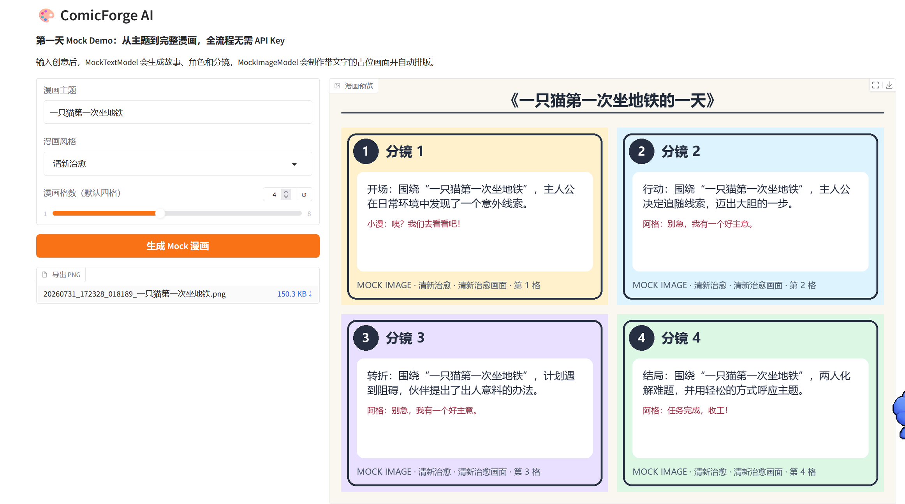
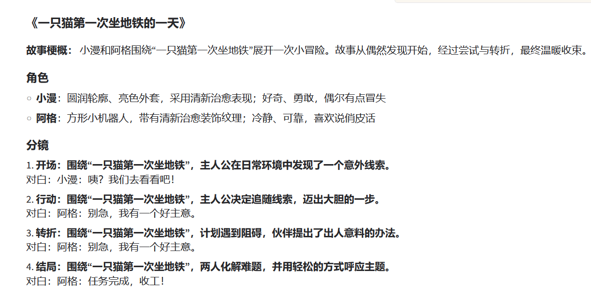
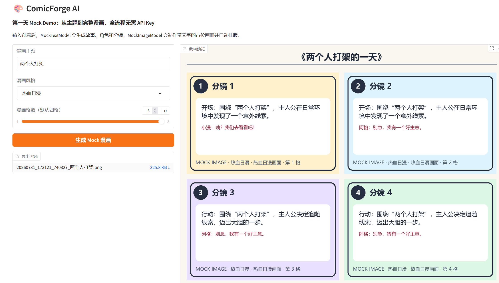
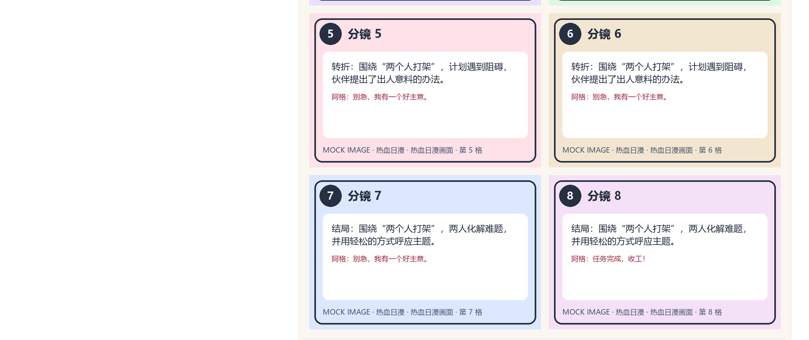
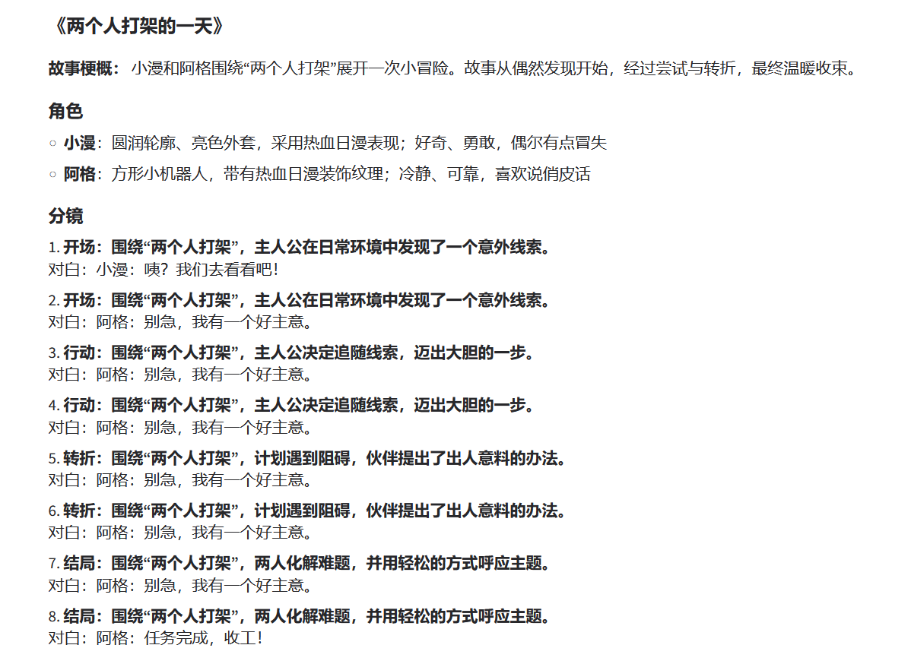
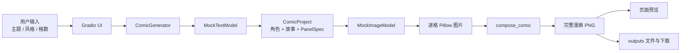

# ComicForge AI 第一天进度记录与 Mock Demo 汇报材料

> 记录日期：2026-07-31  
> 当前阶段：Day 1——项目骨架与本地 Mock Demo  
> 文档用途：阶段汇报、Demo 演示、后续开发交接与设计回顾

## 1. 阶段结论

第一天已经完成 ComicForge AI 的基础工程骨架，并跑通了一条不依赖真实大模型的漫画生成链路。用户在中文 Gradio 页面输入漫画主题、视觉风格和格数后，系统可以自动生成结构化故事、角色设定和分镜，再使用 Pillow 绘制带编号、场景文字和对白的 Mock 图片，最后将所有分镜排版为一张可预览、可下载的 PNG 漫画。

当前成果的核心价值不是最终画面质量，而是验证了漫画平台最重要的数据流和模块边界：

1. 用户创意能够转化为统一的漫画项目数据。
2. 文本生成、图片生成、页面排版和 UI 展示相互解耦。
3. 真实模型尚未接入时，前后端完整流程已经可以运行和测试。
4. 后续可以逐个替换 Mock 模型，而不需要推翻现有 UI、数据模型或排版逻辑。

## 2. 已完成功能

| 模块 | 当前实现 | 完成状态 |
| --- | --- | --- |
| Python 工程 | Python 3.11、`src/` 布局、`pyproject.toml` | 已完成 |
| 中文交互界面 | Gradio Blocks 页面 | 已完成 |
| 用户输入 | 漫画主题、风格、1–8 格格数 | 已完成 |
| 文本 Mock | 故事梗概、角色、分镜、对白 | 已完成 |
| 图片 Mock | Pillow 生成彩色分镜占位图 | 已完成 |
| 中文字体 | 自动选择系统中文字体并支持换行 | 已完成 |
| 漫画排版 | 默认双列；四格为 2×2，八格为 2×4 | 已完成 |
| 结果展示 | 漫画 PNG 预览、故事与分镜说明 | 已完成 |
| 文件导出 | 生成带时间戳的 PNG 并提供下载 | 已完成 |
| 数据约束 | Pydantic 项目、角色、分镜模型 | 已完成 |
| 基础测试 | 文本、图片、排版、完整流程 | 已完成 |
| 真实大模型 | 当前阶段不接入、不需要 API Key | 后续计划 |

## 3. 当前 Demo 效果

### 3.1 标准四格漫画案例

输入示例：

- 主题：一只猫第一次坐地铁
- 风格：清新治愈
- 格数：4

页面左侧完成参数输入和 PNG 导出，右侧显示自动排版后的 2×2 四格漫画。每格包含分镜编号、剧情阶段、场景描述、对白和风格标记。



同一次生成还会输出故事梗概、角色信息和完整分镜，便于检查图片生成前的结构化文本结果。



### 3.2 可变格数案例

输入示例：

- 主题：两个人打架
- 风格：热血日漫
- 格数：8

系统可以根据用户选择生成八个 `PanelSpec`，图片模型逐格渲染，排版模块按照双列自动扩展为四行。





八格模式下，故事、人物和 1–8 号分镜仍保持结构一致，证明现有数据模型和生成链路不局限于固定四格。



## 4. 系统实现思路

### 4.1 完整处理流程



这条链路由 `ComicGenerator` 统一编排。UI 只负责收集输入和展示结果，Mock 模型不直接依赖 Gradio，因此后续更换模型时不会污染界面层。

### 4.2 分层与职责

| 代码位置 | 主要职责 |
| --- | --- |
| `app.py` | 本地应用入口，设置 `src` 路径并启动 Gradio |
| `src/comicforge_ai/ui.py` | 中文界面、事件绑定、结果格式化 |
| `src/comicforge_ai/schemas.py` | 漫画项目、角色、分镜的数据契约 |
| `src/comicforge_ai/models/mock_text.py` | 生成确定性的故事、角色和分镜 |
| `src/comicforge_ai/models/mock_image.py` | 将单个分镜渲染为 Pillow 占位图 |
| `src/comicforge_ai/layout.py` | 计算行列、标题区、边距并合成漫画页 |
| `src/comicforge_ai/service.py` | 串联文本、图片、排版和 PNG 保存 |
| `tests/` | 对各模块和完整链路进行回归验证 |

## 5. 数据模型设计

平台使用 Pydantic 定义模块之间传递的数据，而不是让文本模型直接返回无法控制的散乱字符串。

### 5.1 `CharacterProfile`

描述可复用的角色设定：

```python
class CharacterProfile(BaseModel):
    name: str
    appearance: str
    personality: str
```

### 5.2 `PanelSpec`

表示单个漫画分镜，是文本模型和图片模型之间的关键接口：

```python
class PanelSpec(BaseModel):
    number: int
    scene: str
    caption: str = ""
    dialogue: str = ""
```

### 5.3 `ComicProject`

聚合一次漫画创作的全部结构化信息：

```python
class ComicProject(BaseModel):
    title: str
    theme: str
    style: str
    panel_count: int
    story: str
    characters: list[CharacterProfile]
    panels: list[PanelSpec]
    output_path: Path | None = None
```

模型中还包含校验逻辑，保证：

- 格数限制在 1–8。
- `panels` 的实际数量必须等于 `panel_count`。
- 分镜编号必须从 1 开始连续递增。

这使错误可以在数据进入图片生成阶段前被发现。

## 6. 关键代码实现

### 6.1 Mock 文本生成

`MockTextModel` 接收用户输入，并输出已经通过 Pydantic 验证的 `ComicProject`：

```python
project = text_model.generate_project(
    theme=theme,
    style=style,
    panel_count=panel_count,
)
```

当前故事使用“开场—行动—转折—结局”四种节拍。对于 1–8 格，通过分镜位置映射到相应故事节拍：

```python
beat_index = round(
    index * (len(self._beats) - 1) / (panel_count - 1)
)
```

这种实现具有两个作用：一是确保 Mock 结果稳定、便于测试；二是先验证真实模型未来必须返回的数据形态。

### 6.2 Mock 图片生成

`MockImageModel.generate_panel()` 为每个 `PanelSpec` 创建独立图片，主要步骤包括：

1. 根据编号选择背景色。
2. 绘制圆角边框和圆形编号。
3. 绘制场景描述和对白。
4. 根据实际文字宽度逐字换行。
5. 在页脚标注 Mock 状态、风格和分镜说明。

核心调用形式如下：

```python
panel_images = [
    image_model.generate_panel(panel, project.style)
    for panel in project.panels
]
```

Windows 下优先使用微软雅黑或黑体；其他系统也准备了 macOS 和 Linux 字体候选路径，找不到时回退到 DejaVu Sans。

### 6.3 漫画页面排版

`compose_comic()` 根据分镜数量计算行数：

```python
rows = math.ceil(len(panels) / columns)
```

页面由标题区、外边距、分镜间距和图片网格组成。当前默认使用两列，因此四格形成 2×2，八格形成 2×4；少于两格时会自动降为一列。

### 6.4 完整流程编排与导出

`ComicGenerator.generate()` 是整个应用的业务入口：

```python
project = self.text_model.generate_project(theme, style, panel_count)
panel_images = [
    self.image_model.generate_panel(panel, project.style)
    for panel in project.panels
]
comic_page = compose_comic(panel_images, project.title)
comic_page.save(output_path, format="PNG")
```

输出文件使用“时间戳 + 安全化主题名”命名，避免不同生成任务相互覆盖：

```text
outputs/20260731_172328_018189_一只猫第一次坐地铁.png
```

### 6.5 Gradio 事件处理

按钮事件调用统一 UI 处理函数，并一次返回三个结果：

```python
return comic_page, project_markdown, str(project.output_path)
```

分别对应：

- 漫画图片预览；
- 故事、角色和分镜说明；
- 可下载的 PNG 文件。

## 7. 工程与运行环境

当前实际验证环境：

| 项目 | 版本/说明 |
| --- | --- |
| Python | 3.11.15 |
| Gradio | 5.50.0 |
| Pillow | 11.3.0 |
| Pydantic | 2.12.3 |
| pytest | 9.1.1 |
| 虚拟环境 | 项目内 `.venv` |
| API Key | 不需要 |
| 大模型权重 | 未安装、未下载 |

项目依赖隔离在仓库内部 `.venv`，生成图片默认写入项目内部 `outputs/`。`.venv`、`.env` 和 `outputs/` 均已加入 `.gitignore`，避免提交本地环境、私密配置和运行产物。

## 8. 测试与验证记录

已执行：

```powershell
.\.venv\Scripts\python.exe -m pytest
```

结果：

```text
collected 6 items
6 passed
```

测试覆盖：

| 测试文件 | 验证内容 |
| --- | --- |
| `tests/test_mock_text.py` | 四格项目结构、连续编号、空主题校验 |
| `tests/test_mock_image.py` | 图片模式和尺寸 |
| `tests/test_layout.py` | 四张图片的 2×2 页面尺寸 |
| `tests/test_service.py` | 从主题输入到 PNG 文件的完整链路 |

此外进行了真实启动冒烟测试：

- Gradio `Blocks` 构建成功。
- 完整 Mock 生成成功。
- 四格成品尺寸为 1528×1148。
- `http://127.0.0.1:7860` 返回 HTTP 200。
- 页面包含 `ComicForge AI` 标题。

## 9. 启动与演示方式

在项目根目录执行：

```powershell
.\.venv\Scripts\python.exe app.py
```

浏览器访问：

```text
http://127.0.0.1:7860
```

建议汇报演示顺序：

1. 说明当前阶段完全不调用 API，重点是验证架构和全流程。
2. 输入一个具体主题，选择风格，保持默认四格。
3. 点击“生成 Mock 漫画”，展示右侧 2×2 预览。
4. 向下展示结构化故事、角色与分镜。
5. 点击 PNG 下载，说明生成结果已完成落盘。
6. 将格数改为 8，展示同一流程能够动态扩展。
7. 最后说明后续只需替换 Mock 适配器，即可逐步接入真实模型。

## 10. 当前局限

当前版本是流程验证 Demo，仍有以下明确边界：

1. 文本内容来自确定性模板，并不具备真实大模型的理解和创作能力。
2. 图片是文字占位图，不包含真实人物、场景或动作绘制。
3. 故事只有四类基础节拍；格数大于四时会出现相邻分镜节拍重复。
4. 角色设定目前只参与文本展示，尚未形成跨分镜的视觉一致性约束。
5. 页面布局当前以固定双列为主，尚不能选择条漫、单页、跨格等模板。
6. 项目数据尚未持久化，暂不支持保存后重新编辑。
7. 当前只导出整页 PNG，暂未单独导出项目 JSON 和原始分镜图。

这些不是链路故障，而是 Day 1 阶段主动控制的实现范围。

## 11. 后续建议

### 优先级 P0：稳定接口

- 为文本模型和图片模型定义 `Protocol` 或抽象接口。
- 增加 `ComicProject` JSON 保存和加载。
- 增加异常状态、生成进度和日志信息。

### 优先级 P1：提升可编辑性

- 支持生成后修改故事、角色和单个分镜。
- 支持只重新生成某一格。
- 增加对白气泡和角色名称样式。
- 增加横版、竖版、条漫等排版模板。

### 优先级 P2：接入真实模型

- 首先替换 `MockTextModel`，验证真实模型能稳定输出 Pydantic 结构。
- 再替换 `MockImageModel`，保留 Pillow 占位图作为离线降级方案。
- 为真实模型增加超时、重试、成本统计和内容安全检查。
- 建立角色参考图和跨分镜一致性流程。

## 12. 汇报摘要

可以用下面这段话概括第一天成果：

> ComicForge AI 第一天完成了标准 Python 工程骨架和一个全本地 Mock Demo。系统已经能够接收漫画主题、风格和格数，生成结构化故事、角色与分镜，再用 Pillow 生成分镜占位图并自动排版为可预览、可下载的 PNG。当前虽然没有调用真实大模型，但从 UI、数据模型、生成编排到结果导出的完整链路已经跑通，并通过了 6 项自动化测试。后续开发可以在保持现有流程稳定的前提下，逐步将 Mock 文本模型和 Mock 图片模型替换为真实模型。

## 13. 相关文件索引

- 应用入口：[`../app.py`](../app.py)
- 中文界面：[`../src/comicforge_ai/ui.py`](../src/comicforge_ai/ui.py)
- 数据模型：[`../src/comicforge_ai/schemas.py`](../src/comicforge_ai/schemas.py)
- 文本 Mock：[`../src/comicforge_ai/models/mock_text.py`](../src/comicforge_ai/models/mock_text.py)
- 图片 Mock：[`../src/comicforge_ai/models/mock_image.py`](../src/comicforge_ai/models/mock_image.py)
- 漫画排版：[`../src/comicforge_ai/layout.py`](../src/comicforge_ai/layout.py)
- 流程编排：[`../src/comicforge_ai/service.py`](../src/comicforge_ai/service.py)
- 测试目录：[`../tests/`](../tests/)
- 项目说明：[`../README.md`](../README.md)
- 任务清单：[`../TASKS.md`](../TASKS.md)

