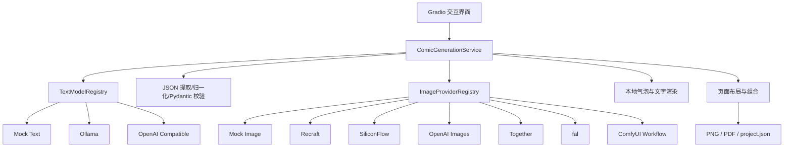

# ComicForge AI 项目成果与技术说明

> 项目类型：多模型集成的 AI 辅助漫画制作平台  
> 开发语言：Python 3.11  
> 前端框架：Gradio  
> 当前版本：0.3.0  
> 文档日期：2026-08-06

## 摘要

ComicForge AI 是一个面向漫画创作流程的多模型集成平台。系统把文本生成、剧本审查、图片生成、漫画排字、页面排版和成果导出拆分为相互独立的模块，使本地模型与云端模型能够按需组合和替换。

用户可以输入主题、故事梗概或完整剧本，由文本模型生成结构化故事、角色设定和分镜；系统可调用独立的审查模型检查人物关系、时间线、因果、连续性和分镜可视化程度；用户确认后，再由图片模型逐格生成无文字画面。对白、旁白、思想和拟声词由程序在本地绘制，最终组合为可预览、可继续编辑、可导出 PNG/PDF 的漫画页面。

当前项目已经形成从故事输入到漫画成品的完整单页闭环，支持离线 Mock、本地 Ollama、本地 ComfyUI、OpenAI-compatible 文本接口以及多种云端图片 Provider。Recraft 和 ComfyUI 已完成真实图片生成验收；其他部分 Provider 已完成代码适配或鉴权验证。

> **建议配图 1：项目首页全景**  
> 展示侧栏设置、任务状态、漫画画布和分镜编辑区域。  
> 图注建议：ComicForge AI 中文漫画制作工作区。


图 1：ComicForge-AI 最终四格漫画生成效果


## 1. 项目背景与目标

### 1.1 项目任务

项目目标是利用开源或闭源大模型，开发一个能够集成多种模型的漫画制作平台，降低不同模型之间的接入和切换成本，并形成可运行、可演示、可继续扩展的程序源代码。

项目重点考察：

- 编程大模型的应用与集成能力；
- 快速理解需求并形成可执行方案的能力；
- 将复杂任务拆分为数据、模型、服务、前端和测试模块的能力；
- 调研并接入开源模型、本地工作流和云端 API 的能力；
- 对真实运行问题进行定位、修复和验证的能力。

### 1.2 项目目标

本项目确定了以下核心目标：

1. 文本模型和图片模型可以独立选择与组合。
2. 不把某个厂商的协议写死在前端或主业务流程中。
3. 模型输出必须经过安全解析和结构校验，不能直接作为可信数据使用。
4. 图片模型只负责画面，漫画文字由程序本地排版，保证可编辑性。
5. 真实 Provider 失败、发生 Mock 回退或审查未应用时必须对用户可见。
6. 在没有 API Key 和本地模型时，仍能通过 Mock 完成离线演示。
7. 保存生成记录，使每一格图片的 Provider、模型、耗时和错误可以追溯。

## 2. 最终成果概览

当前系统已经实现以下完整流程：

```text
故事或自然语言要求
  → 文本模型生成结构化初稿
  → 独立剧本审查与修订
  → 用户检查、编辑或重做分镜
  → 图片模型逐格生成无文字画面
  → 本地绘制气泡、旁白和拟声词
  → 漫画页面自动排版
  → 预览、单格重生成、版本回退
  → 导出 PNG、PDF 和 project.json
```

成果不只是单次生成脚本，还包括：

- 可运行的 Gradio 中文界面；
- 统一文本 Provider 架构；
- 统一图片 Provider 架构；
- 本地 ComfyUI API Workflow 接入；
- 云端 Recraft 真实生成闭环；
- 安全 JSON 解析、修复与 Pydantic 校验；
- 漫画排字、页面布局和导出模块；
- 项目保存、载入、局部重生成和历史回退；
- 自动化测试、严格 Provider smoke test 和阶段文档。

> **建议配图 2：完整生成结果**  
> 展示一份已完成的四格漫画以及右侧生成状态。  
> 图注建议：从结构化分镜到自动排字和页面组合的最终结果。

## 3. 总体技术架构

### 3.1 分层设计

系统采用分层与 Provider 注册表架构：



各层职责如下：

| 层级 | 主要职责 |
|---|---|
| `ui.py` | 收集用户输入、展示状态、调用服务，不包含 Provider 专用协议 |
| `service.py` | 编排文本、审查、图片、回退、持久化和局部重生成 |
| `schemas.py` | 定义跨模块使用的 Pydantic 数据模型 |
| `models/` | 文本和图片 Provider、注册表、HTTP、安全下载与错误类型 |
| `prompts/` | 文本生成、审查、翻译和图片提示词 |
| `bubble_renderer.py` | 本地绘制对白、旁白、思想和拟声词 |
| `layout.py` | 漫画画框、页面组合和导出布局 |

### 3.2 统一 Provider 设计

所有文本模型实现统一的 `TextModelProvider`；所有图片模型实现统一的 `ImageProvider`。Provider 专用的 URL、鉴权头、请求体、响应解析和轮询逻辑均封装在对应模块中。

前端从注册表读取可选模型和能力，不需要针对 Recraft、ComfyUI 或其他平台分别编写生成流程。这样可以实现：

- 文本创作模型与剧本审查模型独立选择；
- 文本模型与图片模型独立组合；
- 新 Provider 按统一接口接入；
- 不支持的参数在请求前明确报错；
- Provider 切换不应破坏其他已验证组合。

> **建议配图 3：模型设置区域**  
> 展示文本模型、审查模型和图片模型三个独立选择框。  
> 图注建议：文本创作、剧本审查和图片生成模型可独立组合。

## 4. 核心数据与生成流程

### 4.1 核心数据模型

系统以 `ComicProject` 作为完整项目对象，主要包含：

- 项目标题、主题、风格、内容语言；
- 故事梗概和标题候选；
- 角色身份、外观、服装、道具和视觉设定；
- Story Bible：时间线、人物动机、关系和关键对象；
- 每格场景、画面描述、出场角色、动作和叙事作用；
- `speech/thought/narration/sfx` 四类漫画文字；
- 英文 `image_prompt`；
- 页面、布局、自定义画框和子镜头信息；
- 每格图片 Provider、模型、路径、耗时、request ID、seed 和回退状态；
- 单格历史版本、本地化缓存和修订记录。

### 4.2 文本生成与审查

文本阶段采用“生成—解析—校验—修复”的流程：

1. 提示词要求模型返回严格 JSON。
2. 提取纯 JSON 或 Markdown JSON 代码块。
3. 使用有限白名单处理常见字段别名和安全类型偏差。
4. 通过 Pydantic 校验必填字段、类型、格数和连续序号。
5. 检查内容语言、可见漫画文字、对白同质化和基础可用性。
6. 首次输出不合格时进行一次干净修复重试。
7. 审查模型只返回需要修改的紧凑补丁；遗漏字段从已验证初稿继承。
8. 审查成功才设置 `review_applied=true`；失败时保留真实初稿并显示原因。

审查请求使用紧凑叙事快照，不再重复发送冗长图片提示词；普通生成和审查使用独立超时，避免可选审查占用完整五分钟等待时间。

### 4.3 图片生成

图片阶段在用户确认分镜后执行：

1. 根据页面布局和画框比例计算每格请求尺寸。
2. 为支持 seed 的 Provider 分配逐格 seed。
3. 只发送当前分格的视觉提示词，不让图片模型绘制对白和气泡。
4. Provider 返回 URL、base64 或异步任务结果。
5. 下载内容经过 Content-Type、字节上限和 Pillow 解码检查。
6. 图片保存为本地 `panel_XX.png`。
7. 本地渲染漫画文字并组合为页面。
8. 保存 `comic.png`、`comic.pdf` 和 `project.json`。

### 4.4 ComfyUI 工作流

ComfyUI 使用 API Format Workflow JSON。程序不会修改源文件，而是复制工作流并动态替换：

- 正向提示词节点；
- 负向提示词节点；
- width 和 height；
- seed；
- 可选参考图 `LoadImage` 节点。

调用链为：

```text
GET /system_stats
  → 可选 POST /upload/image
  → POST /prompt
  → GET /history/{prompt_id}
  → GET /view
  → 保存本地图片
```

当前主工作流包含 Animagine XL 和 IPAdapter。无参考图时会旁路参考适配器，避免工作流中的示例图污染故事场景。

> **建议配图 4：ComfyUI API Workflow**  
> 标注 KSampler、Checkpoint、Prompt、Latent、IPAdapter 和 SaveImage 节点。  
> 图注建议：ComicForge AI 动态修改并提交的 ComfyUI API 工作流。

## 5. 当前已实现功能

### 5.1 创作和分镜

- 输入主题、自然语言要求或完整故事；
- 选择内容语言和漫画风格；
- 设置任意正整数格数，不在核心服务中固定为四格或八格；
- 生成故事梗概、角色、Story Bible、标题候选和完整分镜；
- 独立选择创作模型和审查模型；
- 在真实图片生成前编辑标题、画面、对白和旁白；
- 根据用户补充的正确故事重新设计全部分镜；
- 保存多轮故事修订记录。

### 5.2 图片与漫画制作

- Mock 离线图片；
- Recraft 云端真实生成；
- ComfyUI 本地真实生成；
- 其他已注册图片 Provider 的统一适配；
- 严格无 Mock 回退模式；
- 逐格图片保存和生成来源记录；
- 自动气泡、旁白、思想和拟声词渲染；
- 中文、英文和日文排字支持；
- 传统漫画页、网格、竖向条漫和自定义画框；
- 单格内部 inset、split 和 montage 辅助镜头；
- 全屏滚轮缩放、鼠标拖动画幅和双击复位；
- PNG 和 PDF 导出。

### 5.3 项目编辑和恢复

- 保存并重新载入 `project.json`；
- 生图后切换漫画文字语言，不重新调用图片 Provider；
- 单格重新生成；
- 原图片自动归档到 `panel_versions/`；
- 按版本恢复历史分格；
- 恢复后重新排字和组合整页；
- 保存实际 Provider、模型、耗时、参数和错误摘要。

### 5.4 状态与错误反馈

- Provider 配置状态和服务可用性检查；
- 请求 Provider 与实际 Provider 分开显示；
- 文本、审查和图片耗时显示；
- Mock fallback 分格和原因显示；
- 配置、鉴权、余额、限流、内容策略、网络、生成超时、轮询超时、响应结构和保存错误分类；
- 审查执行与审查应用状态分开记录。

> **建议配图 5：分镜编辑和状态信息**  
> 展示结构化分镜表、审查状态以及实际 Provider/耗时。  
> 图注建议：付费生图前的剧本确认和可追溯状态。

> **建议配图 6：单格重生成和历史回退**  
> 展示分格选择、重新生成和版本恢复控件。  
> 图注建议：局部修改不会要求重新生成整页图片。

## 6. Provider 实现与验收状态

“已实现”“已注册”“已配置”“已完成鉴权”和“已完成真实生成”是不同状态，不能混为一谈。

### 6.1 文本 Provider

| Provider | 已实现 | 已注册 | 当前验收情况 | 主要限制 |
|---|---:|---:|---|---|
| Mock | 是 | 是 | 确定性离线闭环完成 | 不是大模型真实内容 |
| Ollama | 是 | 是 | 本机 `qwen3:4b` 真实文本生成完成 | 小模型长 JSON 和审查输出存在随机性；可能与 ComfyUI 争显存 |
| OpenAI Compatible | 是 | 是 | 已有 `qwen3:4b` 真实生成及审查项目记录 | 不同兼容服务的格式、速度和 token 上限不同 |

### 6.2 图片 Provider

| Provider | 已实现 | 已注册 | 网络/鉴权 | 真实生成 | 当前结论 |
|---|---:|---:|---|---|---|
| Mock | 是 | 是 | 不需要 | 离线占位图完成 | 适合无凭据演示和文本链路测试 |
| Recraft | 是 | 是 | 已完成 | **已完成，多次手动测试及四格无回退记录** | 当前主要云端真实生成路线 |
| ComfyUI | 是 | 是 | 本地健康和工作流检查完成 | **已完成 512×512 严格单图和无回退项目** | 当前本地真实生成路线 |
| SiliconFlow | 是 | 是 | **国际站鉴权成功；模型列表 200；目标模型存在** | **未完成** | 账户余额为 0，未进行收费生成验收 |
| OpenAI Images | 是 | 是 | 当前无配置证据 | 未验收 | 完成代码适配和离线协议测试 |
| Together | 是 | 是 | 当前无配置证据 | 未验收 | 完成代码适配和离线协议测试 |
| fal | 是 | 是 | 当前无配置证据 | 未验收 | 完成代码适配和离线队列测试 |

自动化测试通过只能证明协议映射和错误处理，不等同于真实平台验收。

## 7. 关键问题、改进方法与成效

本节按照实际开发顺序和问题类型，对 Day 1、Stage 2、Stage 3 以及后续验收记录进行汇总。表格中的“成效”来自自动化测试、真实 Provider 输出、项目 JSON 或前端人工验证；没有真实验收的内容不会写成已完成。

### 7.1 从 Mock 原型到可替换架构

| 问题或阶段限制 | 原因分析 | 改进方法 | 改进成效 |
|---|---|---|---|
| Day 1 只有确定性文本模板 | 初期目标是先验证端到端流程，没有真实大模型接口 | 定义 `TextModelProvider`，实现注册表和环境构建；保留 Mock 作为离线基线 | Ollama、OpenAI-compatible 和 Mock 可通过同一服务接口切换 |
| Day 1 图片只是 Pillow 文字占位图 | 尚未定义真实图片模型边界 | 定义 `ImageProvider`、请求、结果和能力模型，注册多个图片 Provider | Mock、云端 API 和 ComfyUI 共用逐格生图与排版流程 |
| 初期格数大于四时故事节拍重复 | Mock 故事只有固定四段节拍 | 把格数作为核心 schema 和服务参数；真实文本模型按请求生成不同叙事作用 | 已用 13 格结构测试证明核心层不固定为四格或八格 |
| 初期固定双列排版 | 漫画格数、镜头和页面布局被绑定 | 新增传统页、规则网格、竖向条漫、自定义画框和 `importance` | 四格稳定 2×2，五/六格可突出重点，也可选择长条漫画 |
| 初期无法保存和恢复项目 | 只有最终 PNG，没有持久化协议 | 增加 `ComicProject` JSON、相对路径和生成溯源 | 可重新载入项目、继续编辑、切换语言和局部重生成 |
| UI/主流程容易出现 Provider 条件分支 | 平台协议直接进入业务代码会使模型组合相互影响 | Provider 专用 URL、鉴权、payload 和解析只放在 Provider 模块；UI 读取注册表和能力 | 新增或更换 Provider 不需要重写主生成流程 |

### 7.2 文本模型、结构化输出与剧本审查

| 问题表现 | 根本原因 | 改进方法 | 改进成效 |
|---|---|---|---|
| Ollama 状态可用，正式生成却超时并回退 Mock | 状态请求很短；正式生成含 Thinking 和长 JSON，连接与读取超时未分离 | 分离连接、状态和生成超时；顶层 `think=false`，旧版本回退 `/no_think`；记录耗时和原始异常类型 | 本机 `qwen3:4b` 曾约 15.04 秒完成真实四格文本且无 Mock 回退 |
| Gradio 中 Ollama 固定 300 秒超时，本机命令却可用 | localhost 请求受无效系统代理影响；默认 `8192/16384` 预算使 4B 模型非线性变慢 | 回环地址强制绕过代理；普通预算改为 `4096/8192`，仅明确截断时临时扩大 | 记录中单格约 20.90 秒、四格初稿约 35.21 秒、初稿加审查约 73.31 秒完成 |
| 模型返回 Markdown、解释文字或非法 JSON | 不同模型不稳定遵循 JSON-only 指令 | 提取纯 JSON/代码块；标准 JSON 解析；禁止 `eval`；Pydantic 校验 | 非标准外壳可安全提取，真正非法内容仍明确失败 |
| 输出缺少 `story/characters` 或使用 `summary/cast` | 兼容模型使用常见别名 | 增加有限白名单字段别名归一化，不凭空生成核心内容 | 常见语义等价字段可进入统一 schema，真实缺失仍触发修复 |
| 初稿 panel 缺少 `characters/action/dialogue/narration/visual_description` | 小模型返回紧凑对象，而 schema 中部分字段本可安全缺省 | 初稿阶段对安全可缺省字段使用默认值；scene 可从画面描述恢复；`image_prompt` 仍严格必填 | 紧凑初稿可以跨 Provider 使用，不放松真正必要的数据边界 |
| 审查稿只返回修改字段，导致整稿缺字段 | 审查模型把要求理解为 patch 或部分完整稿 | 支持 `project_patch`；按 sequence 从已验证初稿继承未修改字段 | 审查可以只修改一格动作或对白，不必重复完整大 JSON |
| 审查稿省略整个 `story/characters` | 部分小模型返回 panels 为主的修订稿 | 只在审查阶段继承完全省略的故事和角色；模型实际返回的错误值仍严格校验 | 有效初稿不再因审查冗余字段遗漏而丢失 |
| `story_bible.timeline` 返回对象数组 | 模型用 `{event: ...}` 等对象代替字符串 | 对明确的 `event/description/name/item` 对象安全提取文本，未知对象报错 | 常见审查结构偏差可恢复，错误数据不会静默吞掉 |
| `panels[].characters` 返回 `{name: ...}` 对象 | 模型把角色引用展开为对象 | 安全提取已知 name 字段，其他对象继续严格校验 | 审查模型组合不再因角色引用表示方式不同而失败 |
| `text_items` 使用 `dialogue/content/kind` 等字段 | 不同模型使用不同文字类型和文本键 | 归一化 speech/thought/narration/sfx 常见别名；无可用文字时继承初稿 | 解决多次出现的 type 枚举错误和 text 缺失问题 |
| `character_positions` 返回 `center/left/中文方位` | 小模型没有严格使用七个布局枚举 | 映射常见同义位置；未知值继承初稿合法位置或删除可选提示 | 非剧情布局偏差不再导致整份审查稿作废，schema 本身仍严格 |
| 输出被长度上限截断 | 故事、角色、Story Bible 和全部分镜一次输出过长 | 识别 `done_reason=length`；从干净上下文重试；临时扩大至最多 `8192/16384`；限制字段长度 | 普通请求保持较快，长修订获得一次可控恢复机会 |
| 故事修订把残缺 JSON 再次发给模型 | 修复上下文过长且包含转义、换行和引号 | 修复从原始事实和紧凑 schema 重新生成，不回填大段残缺输出；用户原文由程序写回 | 多行中文故事和引号可安全保留，错误提示从“第 N 行”改为可执行建议 |
| 第一轮故事修改会被下一轮覆盖 | 只有一个说明字符串，没有修订历史 | 新增 `RevisionTurn/revision_history`，累计已确认约束 | 可以连续进行第二、第三轮修改，且全程不调用图片 Provider |
| 历史或原著题材事实、身份和因果错误 | 合法 JSON 不等于正确故事，小模型知识也可能错误 | 增加 Story Bible、事实/时间线/因果审查；允许用户提供权威故事并重做全部分镜 | 明显减少跨时间线和关键因果缺失，但不承诺绝对事实正确 |
| 多格对白重复“龙王，今日我……” | 模型套用同一模板，审查未必纠正 | 检测至少三格重复开头并触发修复；提示词要求对白表达不同立场和信息推进 | 同质化对白在付费生图前被拦截 |
| 中文项目出现英文 scene/action 或 `which吒` | 模型混用语言；旧 UI 只要含一个汉字就判断为中文 | 按目标语言字符比例判断；可靠中文 scene 可用于恢复展示字段；英文 `image_prompt` 保留 | 不再把夹杂汉字的英文描述显示为中文内容 |
| `zh-CN` 项目的对白和旁白仍为英文 | 语言校验遗漏最终显示的 `text_items` | 对 speech/thought/narration 增加语言校验；失败触发修复，连续不合格则停止 | 错误语言不会进入生图和本地气泡排字阶段 |
| 所有格都没有对白、旁白或拟声词 | 结构通过但漫画不可读 | 增加项目级可见文字可用性校验；有用户原故事时可用对应片段补旁白 | 无文字成品不会被误判为正常漫画 |
| 审查等待满 300 秒，总耗时超过八分钟 | 审查复用普通生成超时并重复发送完整项目、长 `image_prompt` | 审查改用叙事紧凑快照；独立 `TEXT_MODEL_REVIEW_TIMEOUT`，默认 90 秒 | 可选审查不再无条件拖满五分钟；超时仍保留已验证初稿 |
| 审查未应用却显示“已回退 Mock” | 状态把审查失败与文本 Provider fallback 混为一谈 | 分离 `fallback_used`、`script_reviewed` 和 `review_applied` | UI 能明确区分“真实初稿成功、审查未应用”和“文本回退 Mock” |
| 标题出现“XX 的暗影/命运/传奇” | 单次生成缺少候选和反模板约束 | 生成三个具体标题候选并提供最终标题编辑框 | 用户可在生图前确认或修改标题 |

> **建议配图 7：文本问题与改进**  
> 可展示“审查未应用但初稿保留”“中文项目英文台词被拦截”或 Story Bible/修订历史。  
> 图注建议：结构化校验、审查状态和用户事实修订共同保障剧本可用性。

### 7.3 云端图片 Provider 与错误边界

| 问题表现 | 根本原因 | 改进方法 | 改进成效 |
|---|---|---|---|
| 图片宽高空值或默认值被 Provider 拒绝 | UI 和统一请求对尺寸语义不一致 | 使用合法默认尺寸；Pydantic 成对校验宽高并限制 64–8192 | 单图与完整漫画采用可预测的有效尺寸 |
| Recraft 单图成功，四格全部报 Seed 不支持 | UI 的 `0` 被当成真实 seed，完整流程无视能力声明 | `0/空值 → None`；Recraft 禁用 seed；仅支持 seed 的 Provider 接收逐格 seed | Recraft 四格进入真实 HTTP 请求且均不携带 seed |
| 一次点击直接消耗四张收费图片 | 文本、审查和图片被串成不可确认的单步流程 | 拆为“生成/审查分镜”和“确认后生图”；保留用户主动选择的一键模式 | 默认在付费前可检查故事、标题、台词和画面描述 |
| Recraft 六格全部 `ConnectError/ConnectTimeout` | 到 `external.api.recraft.ai:443` 的外部网络不可达，而非 Key、seed 或提示词错误 | DNS、TCP、TLS/HTTP 分层检查；连接错误分类；严格模式不混入 Mock | 网络故障不会被误判为代码或参数回归 |
| 设置不存在的 `127.0.0.1:7890` 代理后应用也无法启动 | 复制了未运行的代理端口，且没有配置 `NO_PROXY` | 清除无效代理；只有代理实际监听时才设置；本地地址绕过代理 | Gradio、Ollama 和本机服务不再被错误代理阻断 |
| SiliconFlow 中国站与国际站 Key 混用 | 两站域名和账户体系不同 | 按 Key 所属站点配置 endpoint；单独验证鉴权与模型列表 | 国际站 Key 鉴权成功，`GET /v1/models` 返回 200 |
| SiliconFlow 模型存在但无法收费生图 | 账户余额为 0 | 验收矩阵区分实现、鉴权、模型存在和真实生成 | 准确记录为“未真实收费生图”，避免虚假成果 |
| 不同 Provider 支持参数不同 | 通用 UI 容易静默忽略 seed、mask、参考图或任意尺寸 | `ImageProviderCapabilities` 驱动控件和请求前校验；不支持参数明确拒绝 | 切换 Provider 时参数行为可解释，不再静默丢失 |
| URL/base64 返回可能无效或过大 | 远程内容存在格式、安全和内存风险 | 限制 Content-Type、字节数和下载超时，使用 Pillow 解码验证 | 无效内容不会进入排版；项目 JSON 不保存完整 base64 |
| 重试可能扩大费用或掩盖永久错误 | 鉴权、余额和内容策略重试无意义 | 只重试 429、5xx、连接和超时；400/401/402/403/策略错误不重试 | 重试边界可控，失败原因更准确 |
| 主 Provider 失败后结果看似成功 | Mock fallback 曾可能掩盖真实失败 | 严格模式禁止回退；非严格模式记录每个回退分格、实际 Provider 和原因 | 用户可以区分真实生成、次级 Provider 和 Mock 图片 |

### 7.4 ComfyUI 本地工作流与性能

| 问题表现 | 根本原因 | 改进方法 | 改进成效 |
|---|---|---|---|
| 网页能打开工作流，API `/prompt` 却拒绝 | 使用了普通 UI Workflow JSON，而不是 API Format | 从 ComfyUI 导出 API Format；检查节点键、`class_type` 和 `inputs` | 工作流可由程序复制、修改并提交 |
| prompt、width、height、seed 修改无效 | 节点 ID 按画布位置猜测或工作流版本变化 | 从 JSON 连线核对节点；使用环境变量配置，部分节点自动检测 | 动态参数能够真正进入 KSampler/Latent/CLIP 节点 |
| ComfyUI 初次启动报模型或节点缺失 | checkpoint、IPAdapter、CLIP Vision、自定义节点未安装或名称不符 | 分层检查 8188、`/system_stats`、workflow、checkpoint 和自定义节点 | 已完成本地 512×512 严格单图生成 |
| 普通测试成功却不确定是否发生 Mock 回退 | 完整应用允许 fallback | 提供严格单图 smoke 脚本，输出 Provider、模型、耗时、request ID、尺寸和 fallback | ComfyUI 形成可重复的无回退验收方式 |
| 四格运行 600–900 秒，后两格连续超时 | 单 GPU 实际串行，旧逻辑预先提交多个任务，各自从入队时计时 | 本地加速 Provider 真正逐格提交；首格失败即停止后续提交；远程 Provider 保留并发 | 后续格不再在队列中提前消耗 300 秒预算，避免超时叠加 |
| ComfyUI 页面显示 0 活动任务，但应用仍在等待 | 历史任务、轮询状态和前端总状态缺少分格级可见性 | 错误中记录 prompt ID、轮询超时和对应分格；后续任务列入进度 UI P0 | 能判断是队列、GPU 长任务还是应用轮询超时，而非笼统“卡住” |
| SD1.5/Animagine 输出照片、人群、梦境或怪物 | 通用提示词没有针对 checkpoint 词法和分辨率优化 | 增加 ComfyUI/Animagine 专用 prompt profile、负向提示和工作流尺寸 | 输出更接近日漫分格，但仍受本地模型能力限制 |
| 哪吒参考图使所有格变成大人物特写 | IPAdapter PLUS high strength、权重 0.63/结束点 0.8，参考构图压过场景 | 逐步降低权重和作用区间；强调只继承身份、不复制姿势/背景；加强剧情环境 | 参考图影响减弱，远景和故事场景得到更多空间 |
| 只按“主角是否出场”使用参考图仍污染宽景和多人场景 | 主角参与不等于该格适合角色立绘参考 | 参考范围先收紧为单角色近景，后调整为低权重单角色分格；多人分格始终绕过 | 避免把主角身份注入龙王/对手分格，降低多角色污染 |
| 无上传参考图时工作流示例图仍影响生成 | Workflow 内 `LoadImage` 和 IPAdapter 默认连线继续生效 | 无参考图时旁路适配器；可选择首个合适单角色结果作为后续参考 | 不会把示例猫或旧角色带入新故事；自动参考具有明确范围 |
| 用户上传多张参考图但当前工作流只使用一张 | 当前 API Workflow 只有一个 IPAdapter 图像输入 | UI 语义改为单角色参考图，明确能力边界 | 不再暗示多参考图全部生效；多角色工作流保留为后续计划 |

> **建议配图 8：ComfyUI 问题与改进**  
> 可展示 API Workflow 节点、严格 smoke 输出，以及参考图权重调整前后的场景差异。  
> 图注建议：从工作流可调用到参考图范围和单 GPU 调度的逐步优化。

### 7.5 漫画画面、排字与布局质量

| 问题表现 | 根本原因 | 改进方法 | 改进成效 |
|---|---|---|---|
| 文字像整页底部字幕条 | 初版只在页面底部拼接 dialogue/narration | 使用结构化 `speech/thought/narration/sfx`，逐格本地绘制漫画文字 | 成品从演示字幕转为气泡、无框旁白和拟声词 |
| 气泡尾巴是贯穿画面的白线 | 直接连接气泡与远处人物锚点且无限长 | 尾巴长度限制约 52px；无锚点不画；只表达方向 | 长标注线消失，气泡更接近漫画样式 |
| 旁白框过大、遮挡画面 | 旁白与对白使用相同尺寸上限 | 旁白改为紧凑文字或轻量卡片；自动缩短过长文字 | 旁白占用更少画面，不再像 PPT 文本框 |
| 气泡遮挡人物、手部和关键道具 | 图片生成前没有预留，排字时也不了解画面复杂度 | 提示词加入 `reserved_bubble_regions`；边缘密度评分选择低细节区域；支持表格位置覆盖 | 气泡更倾向放在自然负空间，用户可手动指定大致位置 |
| 不同语言换行和字体不正确 | 中文、英文、日文字符宽度和字体回退不同 | 语言感知换行、字体回退和三语言离线预览 | 中文、英文、日文均可本地排字 |
| 生图后翻译改变文字项数量 | 小模型合并或拆分 `text_items`，无法安全写回 | 每条文字分配稳定 ID；严格检查 ID 集合；保留旧格式兼容和修复重试 | 翻译可按原气泡逐项写回，不需要重新生图 |
| 重复切换语言反复调用模型 | 没有本地化缓存 | `project.localizations` 缓存各语言文字；原始分格图复用 | 已生成语言可免费切换，图片 Provider 调用数为 0 |
| 图片模型在画面内画英文、现成气泡或水印 | “comic”可能被模型理解为整页漫画 | 每次只传单格视觉提示；强化 `no text/no bubble/no watermark`；文字全部本地绘制 | 大幅减少模型文字并保持可编辑性，但生成模型仍可能偶发误画字符 |
| 单格内部出现重复四小格或整页套一格 | 多镜头/漫画页提示过强，模型把分格请求理解为整页 | 默认 `single scene/one camera view`；仅必要格使用 inset/split/montage | 普通格保持一个主画面，多镜头成为受控例外 |
| `composition: single` 被误当成场景描述 | 字段别名冲突 | 移除冲突别名；占位 scene 从可靠画面字段恢复 | 不再把 `single` 作为用户可见场景或图片语义 |
| panel 角色为空时每格被注入全部项目角色 | 提示层把“未知本格角色”解释成“全角色” | 从 speaker、场景文字、角色身份词和位置推断本格角色；环境镜头保持无人 | 不再每格强制注入哪吒、敖丙、夜叉等全部人物 |
| 四格漫画左右空白、模糊补边 | 分格比例和画框比例不匹配，contain 策略用于普通四格 | 四格固定等宽 2×2，并按目标比例请求图片；只在必要异形框使用最接近比例 | 四格稳定铺满，减少空白和模糊背景 |
| 自由页面把边缘气泡裁掉 | 已排字图片再次 `ImageOps.fit` | 先按画框请求原图；异形框使用更保守的缩放/裁切策略 | 气泡不再随二次裁切丢失 |
| 自定义画框出现重叠或残缺空行 | 只保存画框类型，没有完整顺序和配对校验 | 保存 frame order；半行画框成对验证；支持插入、替换、删除和重置 | 自定义布局在付费生图前即可验证，并能重新载入 |
| 模型忽略多镜头要求，所有格仍是 single | 小模型容易忽略 composition 字段 | 从高重要度且具备反应/细节线索的格中提升一格为 inset | 页面有受控视觉变化，不强迫每格拆分 |
| 画布出现白灰交错区域 | Gradio 为 Group/Radio/Image 动态生成多层包装，CSS 只覆盖内部节点 | 在画布局部作用域统一背景变量和祖先包装层 | 预览区域形成连续白色画布，不影响全局主题 |
| 修复画布后预览模式文字消失 | 选中态白字叠加被强制设为白底的 label | 撤销交互 label 的背景覆盖，只统一非交互容器 | 选中态恢复紫底白字，灰条不再出现 |
| 放大阅读只能看到长图局部且无法移动 | 旧交互只改变容器尺寸 | 全屏后支持滚轮缩放、左键拖动和双击复位 | 长幅漫画可在全屏画布中导航查看 |

> **建议配图 9：漫画质量改进前后对比**  
> 优先选择“底部字幕条→漫画气泡”“模糊补边→等宽四格”“参考图特写→剧情场景”三组对比。  
> 图注建议：排字、画框比例和参考图策略的可观察改进。

### 7.6 前端状态、局部重生成与工程质量

| 问题表现 | 根本原因 | 改进方法 | 改进成效 |
|---|---|---|---|
| 用户无法选择是否人工确认 | 最初只有单一生成路径 | 提供人工两阶段和明确的一键模式；自动模式提示额度风险 | 安全确认与快速直出可以按场景选择 |
| 侧栏 Accordion 过多、工作流程不清楚 | 设置和主任务混在同一纵向流中 | 设置收纳到侧栏，主区按分镜、语言、项目导出组织 | 页面更接近“任务工作台”，主要按钮层级更清晰 |
| Provider 技术参数在不支持时仍显示 | UI 没有读取能力声明 | 控件从注册表模型定义和能力动态启用/隐藏 | Recraft 不显示 seed，参考/编辑输入只在支持时出现 |
| 错误散落或只显示 processing | 多回调各自输出技术错误，缺少统一摘要 | 统一状态区展示阶段、实际 Provider、耗时、请求 ID、建议和回退 | 用户可以区分文本、审查、图片和导出阶段 |
| 单格重生成会直接覆盖旧图 | 没有版本机制，失败可能破坏成品 | 临时目录成功后再替换；旧图归档并保存完整 Provider 记录 | 重生成失败不损坏原图，成功后可以回退 |
| 后端已生成新图，前端仍显示旧图 | Gradio 回调引用错误作用域变量，安全边界返回旧 state；浏览器也可能缓存同路径 | 修正回调状态返回；统一更新主 `comic.png/project.json` 和版本选择 | “重生成→新预览→恢复 v1”端到端回归通过 |
| 回退操作本身无法撤销 | 恢复时直接覆盖当前图片 | 恢复前也归档当前图 | 回退成为可逆操作，未选择分格保持不变 |
| 图片路径、Provider 和错误无法追溯 | 早期只保存最终 PNG | `PanelImageRecord` 保存相对路径、Provider、模型、prompt、seed、参数、耗时、request ID、fallback | 可通过 `project.json` 定位文本、图片或参考图责任边界 |
| 自动化测试通过却误认为真实 API 已验收 | 离线协议测试与真实网络/额度/模型是不同层次 | 建立 Ruff、pytest、smoke、手动 UI 和真实平台五级验证 | Recraft/ComfyUI 与未验收 Provider 的状态得到准确区分 |
| 真实响应或下载可能泄露凭据/大数据 | 错误若包含请求头、响应体或 base64 会造成安全风险 | 错误脱敏；不记录 Authorization 和完整响应；限制下载大小 | 项目记录可用于诊断且不保存 Key 或完整图片载荷 |
| Codex 网络中断或 `thread not found` 后上下文丢失 | 开发会话状态异常，不属于项目代码错误 | 每轮恢复先读 AGENTS/TASKS/README/git diff；增加 handoff 和阶段记录，只增补不删历史 | 开发过程可以从仓库事实恢复，不依赖单一会话记忆 |

这些问题说明本项目的改进不是单纯增加功能，而是通过真实模型输出、真实图片、前端操作和项目记录反复验证，在结构稳定性、错误可见性、成本控制和漫画质量之间逐步建立工程边界。

## 8. 测试与验收证据

### 8.1 自动化测试

当前免费检查结果：

```text
pytest：207 passed，10 warnings
相关修改 Ruff：通过
compileall：通过
```

自动化测试覆盖：

- 文本 Provider 状态、生成、Thinking 控制、截断和错误分类；
- JSON 提取、字段归一化、修复、内容语言和 Pydantic 校验；
- 独立审查、部分补丁、错误枚举和审查超时；
- 图片 Provider 请求协议、URL/base64、异步轮询和安全下载；
- 严格模式、按格 fallback、图片记录和路径安全；
- 气泡、多语言排字、布局、自定义画框和页面比例；
- 两阶段生成、项目载入、单格重生成和版本恢复；
- 前端工作区、全屏交互和状态显示。

自动化测试全部使用 Mock transport 或内存图片，不调用收费 API。

### 8.2 真实 Provider 验收

可复核记录包括：

- `outputs/20260805_224941_915906_哪吒/project.json`：Recraft 四格真实生成，无 Mock 回退；单格耗时约 16–24 秒。
- `outputs/20260805_220329_304300_哪吒/project.json`：ComfyUI 无回退生成，保存 request ID、seed 和实际尺寸。
- `outputs/provider_smoke/20260804_125634.png`：ComfyUI 严格单图输出。

真实验收必须同时满足真实服务、真实模型、有效输出文件和无 Mock 回退；不能用 pytest 代替。

> **建议配图 10：project.json 生成来源记录**  
> 只展示 Provider、模型、耗时、request ID、seed、尺寸和 fallback 字段，隐藏任何本机隐私路径。  
> 图注建议：每个分格的生成来源与运行状态可追溯。

## 9. 工程化与安全设计

- API Key 只从环境变量或本机 `.env` 读取；
- `.env.example` 只包含空 Key、localhost 和可迁移相对路径；
- 不在日志、文档和项目 JSON 中保存凭据或完整响应体；
- 不把完整 base64 图片写入项目记录；
- 下载图片限制 Content-Type、最大字节数和超时；
- 进入排版前使用 Pillow 验证图片可解码；
- 只对瞬时网络、429 和 5xx 做有限退避重试；
- 鉴权、余额和内容策略错误不盲目重试；
- 本地模型权重和生成输出不提交 Git；
- Mock fallback 必须显示实际 Provider 和原因。

## 10. 当前局限性

### 10.1 角色一致性仍不稳定

不同分格属于独立扩散采样，仅靠文字提示无法确保人物脸型、服装和细节完全一致。IPAdapter 和参考图能够改善单角色身份，但可能影响构图；多人一致性仍需要角色 LoRA、多个参考适配器或区域条件等方案。

### 10.2 小型文本模型存在随机性

`qwen3:4b` 可能产生字段遗漏、错误枚举、语言混用、重复台词或长输出截断。系统已经增加修复和校验，但不能保证每次第一次请求都成功。

### 10.3 生成速度受模型和硬件影响

Recraft 依赖网络；ComfyUI 依赖 checkpoint、分辨率、显存和队列；文本审查也会增加时间。当前系统不具备稳定的服务级时延保证。

### 10.4 云端成本和账户限制

云端图片 API 会产生费用并受余额、限流和内容策略影响。SiliconFlow 因余额为 0 尚未完成真实生成验收；OpenAI Images、Together 和 fal 也尚未进行真实平台验收。

### 10.5 多页能力尚未形成完整闭环

项目已经预留 `ComicPage` 和 `page_number` 数据结构，布局也支持多种页面形态，但当前主要验收对象仍是单个项目的一页漫画。多页创建、逐页编辑、页间导航和整册导出尚未完成完整 UI 验收。

### 10.6 编辑能力仍有提升空间

当前支持表格修改文字位置、单格重生成和历史回退，但气泡还不能直接在画布上鼠标拖拽；主体/人脸检测和更精细的遮挡避让尚未实现。

### 10.7 尚未部署为多人在线服务

当前系统以本机 Gradio 应用运行。没有用户账户、任务隔离、远程对象存储、权限管理或实际公网部署证据，因此不能描述为多人在线平台。

## 11. 后续改进计划

### P0：演示与生成稳定性

- 显示逐格“等待、生成、下载、完成、超时”进度；
- 失败分格续跑并复用已经成功的图片；
- 固化 Recraft 四格和 ComfyUI 严格 smoke 验收流程；
- 修复当前工作树剩余静态检查问题并持续执行完整免费检查。

### P1：漫画质量与编辑

- 增加气泡拖拽和主体/人脸避让；
- 研究角色 LoRA、多参考图和区域条件工作流；
- 完成多页创建、逐页编辑和整册导出；
- 增加可选漫画字体和透视拟声词。

### P2：平台化能力

- 在获得预算后分别验收尚未真实生成的 Provider；
- 增加任务队列、用户隔离、远程存储和部署方案；
- 按统一接口继续扩展新的文本与图片模型。

## 12. 总结

ComicForge AI 已经从最初的 Mock 演示原型发展为具备真实文本和图片模型接入能力的漫画制作平台。项目完成了统一 Provider 架构、结构化分镜、剧本审查、真实逐格生图、本地漫画排字、多种页面布局、项目持久化、单格重生成、版本回退和 PNG/PDF 导出。

项目的主要价值不仅是接入了多个模型，而是建立了一套可替换、可校验、可追溯、可回退的漫画生成工程流程。开发过程中对模型格式不稳定、网络超时、Provider 能力差异、ComfyUI 工作流、参考图污染、排版质量和语言错误进行了持续定位和改进，并保留了真实验收边界。

当前成果能够完整展示从故事创作到单页漫画成品的流程，同时也清楚保留角色一致性、多页制作、交互编辑和多人部署等后续扩展空间。

## 附录：提交材料建议

建议最终提交包包含：

1. 项目源代码；
2. 本项目成果与技术说明；
3. Demo 录屏视频；
4. 一份可公开展示的 `project.json`；
5. 对应的 `comic.png` 或 `comic.pdf`；
6. README、技术文档和阶段进度报告；
7. 必要的运行说明和无密钥 `.env.example`。

截图中必须隐藏 API Key、真实 `.env`、个人目录和其他隐私信息。
