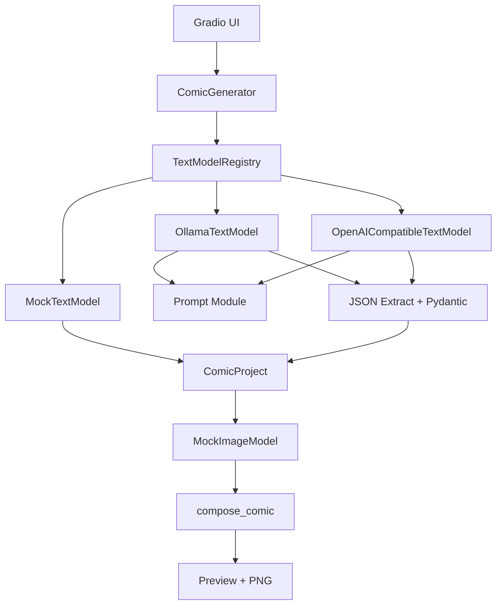

# ComicForge AI 第二阶段进度报告

> 记录日期：2026-08-01
> 阶段主题：真实文本模型接入与统一 Provider 架构
> 验证原则：自动化测试不访问真实 API、不要求真实 API Key；本机 Ollama 仅用于人工冒烟验证；不破坏第一阶段 Mock 漫画闭环

## 1. 完成结论

第二阶段已经建立统一的文本模型适配层。`MockTextModel`、`OllamaTextModel` 和 `OpenAICompatibleTextModel` 使用同一个 `TextModelProvider` 接口，主业务层只通过注册表选择 Provider，不包含 Ollama、Chat Completions 或 API 配置判断。

真实 Provider 返回的文本会经过统一流程：要求 JSON、提取可能存在的 Markdown JSON 代码块、检查必需字段、使用 Pydantic 建模、在失败时进行一次可配置的完整 JSON 修复。远程服务不可用或最终解析失败时，可显式回退到 Mock，生成结果会记录请求 Provider、实际 Provider、模型名称、回退状态和失败原因。

第一阶段的 Pillow 图片占位图、自动排版、Gradio 预览和 PNG 导出保持可用。

本机已使用 `qwen3:4b` 完成真实 Ollama 生成验证：模型在 RTX 4060 Laptop GPU 上运行，`ollama ps` 显示 100% GPU，文本方案生成约耗时 15.04 秒；请求采用 `api_think_false` 控制 Thinking，实际 Provider 为“Ollama 本地模型”，没有发生 Mock 回退，并成功得到故事梗概、角色设定、四格分镜和绘图提示词。

## 2. 新增文件

| 文件 | 用途 |
| --- | --- |
| `src/comicforge_ai/models/base.py` | 统一 Provider 接口、状态对象和错误类型 |
| `src/comicforge_ai/models/http.py` | httpx JSON transport，分离连接/生成超时并隐藏敏感响应内容 |
| `src/comicforge_ai/models/parsing.py` | JSON 提取、必需字段检查和 Pydantic 校验 |
| `src/comicforge_ai/models/registry.py` | Provider 注册、查找和环境配置构建 |
| `src/comicforge_ai/models/ollama_text.py` | Ollama `/api/tags` 与 `/api/chat` 适配器 |
| `src/comicforge_ai/models/openai_compatible_text.py` | 通用 `/models` 与 `/chat/completions` 适配器 |
| `src/comicforge_ai/prompts/__init__.py` | 提示词模块导出 |
| `src/comicforge_ai/prompts/comic_generation.py` | 漫画生成与 JSON 修复提示词 |
| `tests/provider_fixtures.py` | Provider 测试共用的合法漫画 JSON |
| `tests/test_parsing.py` | JSON 提取、校验和错误测试 |
| `tests/test_registry.py` | 注册、查找、重复 ID 测试 |
| `tests/test_text_providers.py` | 状态检测、Mock HTTP 和修复重试测试 |
| `tests/test_http_transport.py` | 连接/读取超时、异常保留和安全 HTTP 错误测试 |
| `tests/test_service_fallback.py` | 显式 Mock 回退和任意格数测试 |
| `docs/STAGE2_PROGRESS_REPORT.md` | 本阶段记录文件 |

## 3. 修改文件

| 文件 | 主要变化 |
| --- | --- |
| `schemas.py` | 扩展角色、分镜和页面结构；移除底层 8 格上限 |
| `mock_text.py` | 实现统一接口并生成完整分镜字段 |
| `mock_image.py` | 兼容扩展后的分镜字段 |
| `models/__init__.py` | 导出所有 Provider、状态和注册表 |
| `service.py` | Provider 选择、来源记录、显式回退和旧接口兼容 |
| `ui.py` | 模型选择、状态检测、实际模型与回退展示 |
| `__init__.py` | 导出扩展后的公共数据和结果类型 |
| `.env.example` | 增加 Ollama、OpenAI-compatible、超时、重试和回退配置 |
| `.gitignore` | 补充本地缓存、临时文件和模型权重忽略规则 |
| `pyproject.toml` | 项目版本更新为 0.2.0 |
| `README.md` | 增加 Provider 架构、配置和运行说明 |
| `TASKS.md` | 记录第二阶段完成项与后续任务 |
| `AGENTS.md` | 增加长期 Provider、提示词、解析、密钥和测试约束 |

## 4. 架构说明



关键边界：

1. UI 不知道 Provider 的 URL、请求格式或 API Key。
2. Service 只依赖统一接口和注册表。
3. Provider 负责远程协议，但不依赖 Gradio、图片或排版。
4. Prompt 独立于 Provider，因此不同服务使用相同结构要求。
5. 解析器统一处理所有真实模型输出，不使用 `eval`。
6. 图片与排版只接收经过校验的 `ComicProject`。

## 5. 数据结构扩展

### 角色

`CharacterProfile` 当前包括：

- `name`
- `role`
- `appearance`
- `personality`
- `visual_prompt`

### 分镜

`PanelSpec` 当前包括：

- `sequence`
- `page_number`
- `scene`
- `visual_description`
- `characters`
- `action`
- `dialogue`
- `narration`
- `image_prompt`

为了兼容第一阶段，`number` 和 `caption` 仍作为只读兼容属性存在。核心结构不再限制 4 格或 8 格；UI 暂定最大 20 格只用于防止误操作。

`ComicPage` 和 `page_number` 已为未来多页漫画预留结构。当前所有分镜仍排为一张双列长图。

## 6. 当前支持的 Provider

### MockTextModel

- ID：`mock`
- 类型：`mock`
- 始终可用
- 不访问网络、不需要配置
- 用于离线演示、测试和真实模型失败回退

### OllamaTextModel

- ID：`ollama`
- 类型：`local_http`
- 状态检测：`GET /api/tags`
- 生成：`POST /api/chat`
- 地址和模型由环境变量提供
- 服务未启动或模型不存在时返回友好不可用状态
- `/api/chat` 顶层发送 `think=false`，旧接口拒绝时使用 `/no_think` 重试
- 连接超时默认 10 秒，生成读取超时默认 300 秒
- 区分连接失败、HTTP 错误、模型不存在和生成超时
- 请求耗时和原始异常会保留到诊断及显式回退原因

### OpenAICompatibleTextModel

- ID：`openai-compatible`
- 类型：`remote_http`
- 状态检测：`GET /models`
- 生成：`POST /chat/completions`
- `base_url`、API Key、模型和超时均从环境变量读取
- 不绑定具体云平台
- 未配置时注册仍成功，状态显示“未配置”，应用不会启动失败

## 7. 结构化输出与错误处理

真实模型提示词明确要求：

- 保持角色设定一致。
- 每格承担不同叙事作用。
- 对白简短，适合漫画气泡。
- `image_prompt` 包含角色、动作、场景、构图、光线和风格。
- 恰好返回用户指定数量的分镜。
- 所有字段必须出现。
- JSON 外不得输出解释。

解析步骤：

1. 拒绝空响应。
2. 优先提取 Markdown `json` 代码块。
3. 使用 `json.JSONDecoder` 提取第一个 JSON 对象。
4. 检查项目、角色和分镜必需字段。
5. 注入本次请求的主题、风格和预期格数。
6. 使用 `ComicProject.model_validate()` 校验类型、编号和数量。
7. 将非法 JSON、缺失字段和类型错误转成可理解的中文错误。
8. 首次校验失败后可请求一次完整 JSON 修复。
9. 最终失败时由 service 按配置决定是否回退。

## 8. 界面变化

Gradio 页面新增：

- 文本模型选择组件。
- 当前模型状态区域。
- “检测模型状态”按钮。
- Provider 改变后的自动状态刷新。
- 实际 Provider 和模型名称。
- 是否发生 Mock 回退。
- 回退失败原因。
- 1–20 的正整数分镜输入。
- 完整分镜字段展示。

UI 回调只调用 `ComicGenerator` 并格式化结果，没有 Provider HTTP 业务逻辑。

## 9. 配置 Ollama

在本机安装并启动 Ollama，准备模型：

```powershell
ollama pull qwen3:4b
ollama serve
```

在 ComicForge AI 启动终端设置：

```powershell
$env:OLLAMA_BASE_URL="http://127.0.0.1:11434"
$env:OLLAMA_MODEL="qwen3:4b"
$env:OLLAMA_CONNECT_TIMEOUT="10"
$env:OLLAMA_GENERATION_TIMEOUT="300"
.\.venv\Scripts\python.exe app.py
```

进入页面后选择 Ollama，先点击“检测模型状态”，再生成漫画。

## 10. 本机真实 Ollama 验证

本阶段在本机进行了真实文本生成冒烟测试，结果如下：

| 验证项 | 实际结果 |
| --- | --- |
| Ollama 模型 | `qwen3:4b` |
| 计算设备 | RTX 4060 Laptop GPU |
| `ollama ps` | 100% GPU |
| 文本生成耗时 | 约 15.04 秒 |
| Thinking 控制 | `api_think_false` |
| 实际 Provider | Ollama 本地模型 |
| 实际模型 | `qwen3:4b` |
| Mock 回退 | 未发生 |
| 结构化结果 | 成功生成故事梗概、角色设定、四格分镜和逐格绘图提示词 |

这次验证确认了状态检测成功之后，正式 `/api/chat` 请求、`think=false`、长生成超时、JSON 提取与 Pydantic 校验、Provider 来源展示能够共同工作。该结果是一次本机人工验证，不会让 pytest 依赖 Ollama 服务或本地模型。

## 11. 配置 OpenAI-compatible API

在本机启动终端设置：

```powershell
$env:OPENAI_COMPATIBLE_BASE_URL="https://你的服务地址/v1"
$env:OPENAI_COMPATIBLE_API_KEY="在本机填写"
$env:OPENAI_COMPATIBLE_MODEL="你的模型名称"
.\.venv\Scripts\python.exe app.py
```

凭据只应存在于本机进程环境或被 Git 忽略的本地配置中。代码、测试、文档和日志中没有真实凭据。

## 12. 没有真实模型时如何演示

1. 不设置任何 Provider 环境变量。
2. 启动应用。
3. 保持“Mock 文本模型（离线）”。
4. 输入主题、风格和分镜数量。
5. 生成结构化方案、Mock 分镜图片和 PNG。

也可以选择一个未配置的真实 Provider 展示状态检测和显式回退行为。

## 13. 测试结果

执行命令：

```powershell
.\.venv\Scripts\python.exe -m pytest
```

当前结果：

```text
26 passed
```

覆盖内容：

- Provider 注册、查找、重复 ID 和默认列表。
- Mock 正常生成和原有第一阶段回归测试。
- Markdown JSON 代码块提取。
- 正确 JSON、非法 JSON、缺失字段和错误类型。
- Ollama 未启动的状态。
- OpenAI-compatible 未配置状态。
- 两个真实 Provider 的 Mock HTTP 状态与生成。
- `think=false` 请求与 `/no_think` 兼容重试。
- 独立连接/读取超时、原始异常保留和 HTTP 错误分类。
- Ollama 模型不存在的专用错误。
- 一次 JSON 修复重试。
- 真实 Provider 失败后的显式 Mock 回退。
- 13 格漫画结构，证明底层不固定为四格或八格。

测试没有访问真实外部 API，也不要求真实 API Key。

## 14. 当前边界与尚未完成内容

- 当前真实接入成功的是文本模型；`qwen3:4b` 不能直接生成图片。
- 图片 Provider 仍是 `MockImageModel`，只生成带文字的占位预览，因此成品画面仍然模板化。
- 没有使用真实 OpenAI-compatible 凭据；真实服务调用待用户选择平台并在本机配置后验证。
- 暂未实现项目 JSON 保存、重新编辑和单格重生成。
- 暂未生成独立多页文件；只预留了数据结构。
- 不同 OpenAI-compatible 服务可能对 `response_format` 或 `/models` 支持程度不同，必要时后续增加兼容配置开关。

## 15. 下一阶段计划

1. 设计统一 `ImageProvider` 接口，并保留 Mock 图片回退方案。
2. 接入至少一个真实图像生成后端，例如 ComfyUI + Stable Diffusion/FLUX，或兼容的图像生成 API。
3. 将每个 `PanelSpec.image_prompt` 转换成真实分镜图片。
4. 支持单格重新生成和分镜编辑。
5. 改进角色一致性、风格一致性和漫画排版。
6. 完成图片生成失败的错误分类、友好提示和显式 Mock 回退。
7. 后续增加项目 JSON 持久化以及可配置多页 PNG/PDF 导出。
