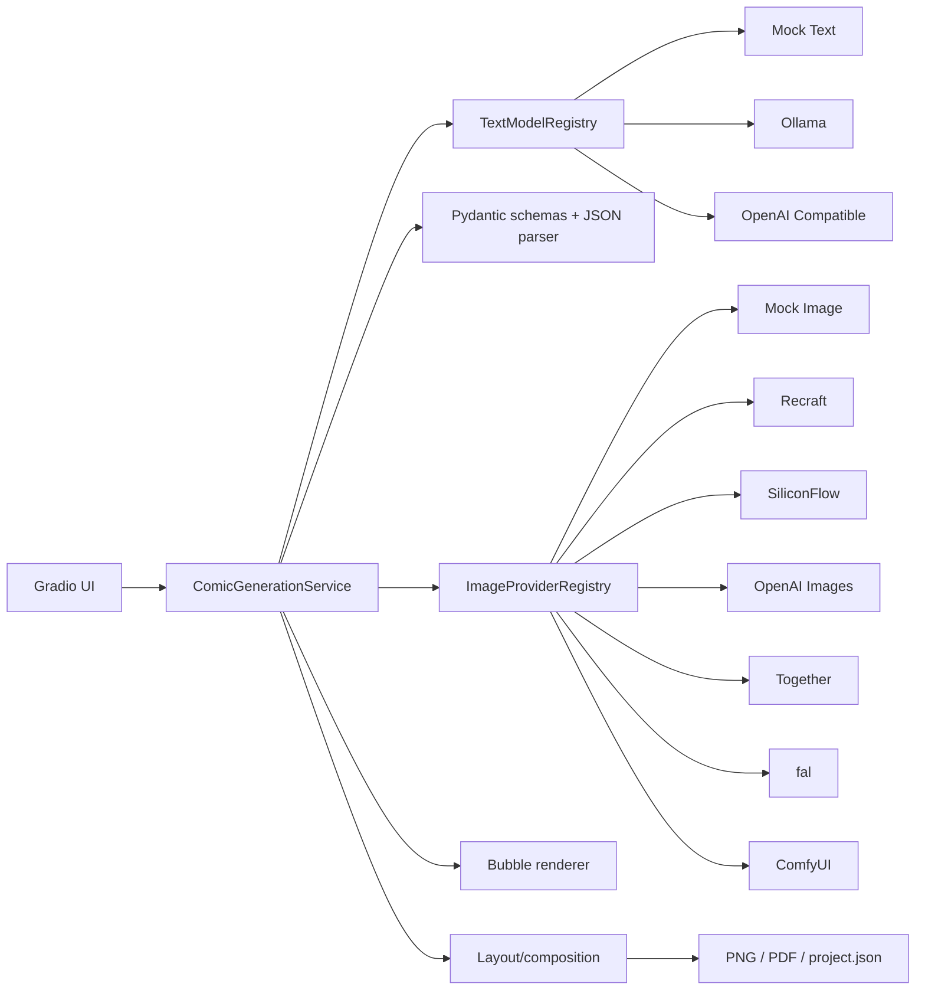

# ComicForge AI 技术文档

> 面向项目评审、开发与维护人员。更新于 2026-08-06，适配 Python 3.11 与项目版本 0.3.0。

## 1. 项目简介、目标与使用场景

ComicForge AI 是一个将文本大模型和图片生成模型统一接入漫画制作流程的 Gradio 平台。用户输入故事或创作要求，文本 Provider 输出结构化故事、角色和分镜；审查 Provider 检查事实、因果与连续性；图片 Provider 逐格生成无文字画面；程序在本地绘制气泡、排版并导出成品。

主要使用场景包括 AI 辅助漫画创作、多模型能力集成与组合验证、本地和云端生成方案对比，以及漫画制作工作流的快速原型验证。当前支持单个项目的一页式漫画制作、项目 JSON 重载与局部重生成。项目预留 `ComicPage/page_number`，但尚未验收完整的多页创作 UI、用户系统、公网部署或多人协作，这些属于非目标或后续工作。

## 2. 总体架构



核心边界：UI 收集参数并调用服务；服务编排阶段和回退；Provider 封装平台协议；`schemas.py` 负责跨组件数据契约；`prompts/` 保存提示词；`bubble_renderer.py` 与 `layout.py` 负责本地排字和页面组合。

## 3. 目录结构

```text
ComicForge-AI/
├── app.py                         # Gradio 入口
├── src/comicforge_ai/
│   ├── schemas.py                 # Pydantic 数据边界
│   ├── service.py                 # 两阶段生成与持久化编排
│   ├── ui.py                      # Gradio 组件和回调
│   ├── layout.py                  # 页面布局
│   ├── bubble_renderer.py         # 本地漫画文字
│   ├── prompts/                   # 文本、审查、翻译和图片提示词
│   └── models/                    # 文本/图片 Provider、注册表和 HTTP 工具
├── scripts/                       # smoke test 与离线预览
├── tests/                         # 不访问真实外部服务的自动化测试
├── workflows/                     # ComfyUI API Workflow 与备份
├── docs/                          # 阶段、配置、技术和 Demo 文档
└── outputs/                       # 运行产物；不应提交
```

## 4. 核心数据模型

`schemas.py` 中的重要模型如下：

| 模型 | 作用 |
|---|---|
| `CharacterProfile` | 角色身份、外观、服装、道具和一致性信息 |
| `StoryBible` / `StoryBibleCharacter` | 时间线、世界观、角色事实和审查依据 |
| `ComicTextItem` | `speech/thought/narration/sfx` 结构化文字及位置 |
| `PanelSpec` | 单格场景、画面、角色、动作、文字、英文 `image_prompt`、子镜头 |
| `ComicPage` | 页号和分格序列的预留结构 |
| `CustomPanelFrame` | 自定义画框类型与次序 |
| `ImageGenerationRequest` | Provider 输入：prompt、尺寸、seed、参考图等 |
| `PanelImageRecord` | Provider、模型、路径、耗时、request ID、参数和 fallback |
| `PanelImageVersion` | 单格历史图片归档 |
| `ComicProject` | 故事、分镜、审查、图片、布局、本地化和输出的完整项目 |

所有模型输出只使用 JSON 工具和 Pydantic 解析，禁止 `eval`。

## 5. 文本生成数据流

1. UI 收集主题、完整故事、风格、语言、格数和文本 Provider。
2. `ComicGenerationService.generate_script_with_status()` 调用创作 Provider。
3. Provider 使用 `prompts/comic_generation.py`，返回 JSON 文本。
4. `models/parsing.py` 提取纯 JSON 或 Markdown 代码块，做有限白名单字段归一化，再用 Pydantic 校验。
5. 解析失败时可进行一次干净 JSON 修复；截断、缺字段和类型错误分别报告。
6. 可选的独立审查 Provider 接收已验证初稿，检查 Story Bible、事实、因果、分镜和语言。
7. 审查稿再次归一化和校验；成功才设置 `review_applied=true`，失败则保留真实初稿并显示原因。
8. 用户可编辑分镜或提交故事补充，确认后才进入图片阶段。

`script_reviewed=true` 说明项目经历了审查流程；`review_applied=true` 说明修订稿实际通过校验并应用。两者不能混为一谈。

## 6. 统一文本 Provider 架构

所有文本模型实现 `models/base.py` 的 `TextModelProvider`。`TextModelRegistry` 按稳定 `model_id` 注册、查找和生成 UI 选项。`build_default_registry()` 从环境变量构造 Mock、Ollama 和 OpenAI Compatible；主流程和 UI 不按 Provider ID 编写生成分支。

### 6.1 Mock Provider

Mock 文本和图片 Provider 提供确定性离线闭环，用于自动化测试、无凭据 Demo、文本组合验证和真实服务故障时的显式备用。Mock 成功不能作为真实 API 验收，发生回退时必须显示请求 Provider、实际 Provider 和原因。

### 6.2 Ollama 调用流程

- `GET /api/tags` 检查服务和模型。
- `POST /api/chat` 发送消息、JSON 格式要求和顶层 `think=false`。
- 对旧兼容行为保留 `/no_think` 提示。
- 连接、状态和生成超时分开配置；`done_reason=length` 会被识别为截断。
- 本地 ComfyUI 生图前可调用 Ollama 卸载接口释放显存。

### 6.3 OpenAI Compatible

该 Provider 适配提供 `/models` 与 `/chat/completions` 的兼容服务，可用于创作或审查。它支持模型名、最大 token、Qwen3 thinking 开关与 reasoning effort 配置。兼容接口并不保证所有服务的响应完全一致，因此解析层仍需校验，且当前项目不能把某一次后端成功推广为所有兼容平台均已验收。

## 7. 图片生成数据流与统一 Provider

1. 用户确认已经通过 Pydantic 的分镜。
2. 服务从页面/画框比例计算每格请求尺寸，并为支持 seed 的 Provider 生成逐格 seed。
3. `prompts/image_generation.py` 只构造当前一格的英文视觉提示；对白、标题和气泡不交给图片模型绘制。
4. 服务根据 `ImageProviderCapabilities` 拦截不支持的参数。
5. Provider 发出真实或本地请求，将 URL/base64/ComfyUI 输出归一化为本地 PNG。
6. 每格记录 Provider、模型、操作、耗时、request ID、seed、尺寸、参数、错误和 fallback。
7. `bubble_renderer.py` 在原图上绘制结构化文字，`layout.py` 组合页面。
8. 保存 `panel_XX.png`、`comic.png`、`comic.pdf` 和 `project.json`。

`ImageProviderRegistry` 注册 Mock、OpenAI Images、Recraft、Together、SiliconFlow、fal 和 ComfyUI。注册只说明代码入口存在；是否配置或真实验收应另行判断。

## 8. 云端图片 Provider

### 8.1 Recraft

`RecraftImageProvider` 调用配置的 `/v1/images/generations` endpoint，提交 prompt、模型、平台支持尺寸/比例、数量和 negative prompt，解析 URL 或 base64，再安全保存。Recraft 能力明确声明不支持 seed，服务不会静默传入 seed。当前已有真实四格无回退记录，是云端 Demo 主路线。

### 8.2 SiliconFlow

Provider 使用原生 `image_size`、`batch_size`、`images` 和 seed 协议，并支持有限参考图字段。当前国际站 Key 已完成鉴权，`GET /v1/models` 返回 200，且目标 `Tongyi-MAI/Z-Image-Turbo` 存在；由于余额为 0，尚未完成真实收费生图验收。

### 8.3 OpenAI Images、Together 与 fal

- OpenAI Images：实现 generations/edits、URL/base64、多图与 Mask。
- Together：实现宽高、比例、negative prompt、seed、数量与 URL/base64。
- fal：实现队列提交、状态轮询、结果获取和最大轮询期限。

三者均已实现、注册并有离线协议测试，但当前工作区没有凭据配置或真实生成验收证据。

## 9. ComfyUI Provider 与 API Workflow

### 9.1 工作流结构

当前 `workflows/comfyui_text2img_api.json` 是以节点 ID 为键、每个节点包含 `class_type` 和 `inputs` 的 API Format JSON。主节点包括 KSampler、CheckpointLoaderSimple、EmptyLatentImage、正/负 CLIPTextEncode、VAEDecode、SaveImage，以及 IPAdapter/LoadImage 节点。普通网页 Workflow JSON 不能直接等同于 API Workflow。

### 9.2 动态替换

Provider 使用 `deepcopy` 创建请求副本，然后：

- `COMFYUI_PROMPT_NODE_ID` 的 `inputs.text` ← 当前分格 prompt；
- negative prompt 节点的 `inputs.text` ← 当前负向提示；
- width/height 节点的相应输入 ← 服务计算尺寸；
- seed 节点的 `inputs.seed` ← 当前分格 seed；
- 有参考图时先调用 `/upload/image`，再替换 LoadImage 输入；无参考图时旁路 IPAdapter，避免默认样例污染故事画面。

源 JSON 不会被修改。节点 ID 必须按 API JSON 核对，不能根据网页画布位置猜测。

### 9.3 HTTP 调用链

```text
GET /system_stats
  → POST /prompt {prompt: workflow_copy, client_id: ...}
  → GET /history/{prompt_id}（循环直到完成或超时）
  → GET /view?filename=...&subfolder=...&type=...
  → Pillow 校验并保存本地 PNG
```

有参考图时，`POST /upload/image` 位于 `/prompt` 之前。轮询超过 `IMAGE_MODEL_MAX_POLL_SECONDS` 抛出 `ProviderTimeoutError`，不会把队列等待误报为连接错误。

## 10. JSON 解析、修复和校验

解析器按以下顺序处理：提取文本 → 去除 Markdown fence → 标准 JSON 解码 → 有限字段别名和类型归一化 → 合并审查稿允许继承的初稿字段 → Pydantic 校验 → 格数、序号和内容语言规则。失败时向模型发起一次完整修复请求；不会执行模型文本，也不会无依据补造核心故事。对截断、缺字段、枚举错误和语言不一致给出可读错误。

## 11. fallback、错误分类和用户提示

文本与图片回退均由环境变量或严格模式控制：

- 文本真实 Provider 最终失败时可回退 Mock；审查失败但初稿有效时保留初稿，并标记“审查未应用”。
- 图片按格执行主 Provider → 可选次级 Provider → Mock 链；严格模式禁止 Mock。
- 可区分未配置、鉴权、余额、限流、内容策略、连接、生成超时、轮询超时、响应结构、下载和保存错误。
- UI 和 `project.json` 保存安全错误摘要与实际 Provider，不保存 Key、请求头或完整响应体。

## 12. 排版、前端与导出

图片模型只生成无文字单格。气泡渲染器根据 `ComicTextItem`、角色锚点、预留区域和图像边缘密度放置 speech/thought/narration/sfx；用户也可在表格中指定位置。布局支持传统漫画页、网格、竖向条漫、自定义画框和有限子镜头。最终输出 PNG 与单页 PDF。

Gradio 前端由侧栏设置、任务状态、漫画画布和“分镜与剧本/成品语言/项目与导出”标签组成。主要交互包括两阶段或一键生成、Provider 状态检查、分镜编辑、故事重做、项目载入、单格重生成/历史回退、多语言重排、全屏滚轮缩放与拖动、PNG/PDF 下载。

## 13. 本地运行

```powershell
Set-Location F:\ZJU_intership\task\2\ComicForge-AI
Copy-Item .env.example .env
.\.venv\Scripts\python.exe app.py
```

浏览器访问 `http://127.0.0.1:7860`。`.env` 只在本机填写，不能提交。

### 13.1 Ollama

```powershell
ollama serve
ollama pull qwen3:4b
ollama list
```

```dotenv
OLLAMA_BASE_URL=http://127.0.0.1:11434
OLLAMA_MODEL=qwen3:4b
OLLAMA_GENERATION_TIMEOUT=300
OLLAMA_NUM_PREDICT=4096
OLLAMA_NUM_CTX=8192
```

### 13.2 ComfyUI

先用 ComfyUI 自身启动方式监听 `127.0.0.1:8188`，安装工作流要求的 checkpoint/自定义节点，再配置：

```dotenv
COMFYUI_BASE_URL=http://127.0.0.1:8188
COMFYUI_WORKFLOW_PATH=workflows/comfyui_text2img_api.json
COMFYUI_MODEL=animagine-xl-4.0-ipadapter
COMFYUI_PROMPT_NODE_ID=6
COMFYUI_WIDTH_NODE_ID=5
COMFYUI_HEIGHT_NODE_ID=5
COMFYUI_SEED_NODE_ID=3
COMFYUI_NEGATIVE_PROMPT_NODE_ID=
COMFYUI_REFERENCE_IMAGE_NODE_ID=
```

健康检查示例：

```powershell
Invoke-RestMethod http://127.0.0.1:8188/system_stats
```

工作流依赖必须与 JSON 中 checkpoint、IPAdapter 和 CLIP Vision 名称匹配。仓库不包含大型模型权重。

## 14. 环境变量配置

| 类别 | 主要变量 |
|---|---|
| 通用文本 | `TEXT_MODEL_*`（含独立的 `TEXT_MODEL_REVIEW_TIMEOUT`）、`RELEASE_TEXT_MODEL_BEFORE_LOCAL_IMAGE` |
| Ollama | `OLLAMA_BASE_URL/MODEL/*TIMEOUT/NUM_PREDICT/NUM_CTX` |
| OpenAI Compatible 文本 | `OPENAI_COMPATIBLE_BASE_URL/API_KEY/MODEL/MAX_TOKENS` |
| 通用图片 | `IMAGE_MODEL_*`、`IMAGE_PANEL_CONCURRENCY`、`IMAGE_PROVIDER_FALLBACK_CHAIN` |
| OpenAI Images | `OPENAI_IMAGE_BASE_URL/API_KEY/MODEL/SIZE` |
| Recraft | `RECRAFT_API_KEY/MODEL/IMAGE_ENDPOINT` |
| Together | `TOGETHER_API_KEY/MODEL/IMAGE_ENDPOINT` |
| SiliconFlow | `SILICONFLOW_API_KEY/MODEL/IMAGE_ENDPOINT` |
| fal | `FAL_KEY/MODEL/BASE_URL` |
| ComfyUI | `COMFYUI_BASE_URL/WORKFLOW_PATH/MODEL/*NODE_ID` |

完整空白模板见 [`.env.example`](../.env.example)。不要在命令历史、截图、文档或 Git 中写真实 Key。

## 15. 测试与验收命令

```powershell
.\.venv\Scripts\python.exe -m ruff check app.py src tests scripts
.\.venv\Scripts\python.exe -m pytest
.\.venv\Scripts\python.exe -m compileall -q app.py src tests
.\.venv\Scripts\python.exe -c "import app; assert app.demo"
git diff --check
```

严格单图 smoke test（示例使用本地 ComfyUI，不调用收费 API）：

```powershell
.\.venv\Scripts\python.exe scripts\smoke_test_image_provider.py `
  --provider comfyui `
  --model animagine-xl-4.0-ipadapter `
  --prompt "single anime comic scene, one hero, no text" `
  --width 512 --height 512
```

Ruff 检查静态代码；pytest 验证离线行为；compile/import 检查可加载性；smoke test 才检查真实 Provider 链路。真实收费 Provider 必须由用户明确触发，自动化通过不等于真实 API 验收。

## 16. 扩展开发指南

### 16.1 新增文本 Provider

1. 在 `models/` 新建模块并实现 `TextModelProvider`。
2. 将 URL、鉴权、payload 和响应解析封装在 Provider 内。
3. 使用 `schemas.py` 数据边界和 `prompts/` 提示词。
4. 在 `TextModelRegistry` 注册，由环境变量构造。
5. 使用假 HTTP transport 增加状态、生成、错误、重试和凭据脱敏测试。
6. 先离线测试，再单独记录真实服务验收。

### 16.2 新增图片 Provider

1. 实现 `ImageProvider` 和准确的 `ImageProviderCapabilities`。
2. 显式拒绝不支持的参数，归一化为 `ImageGenerationResult`。
3. 使用公共安全下载/Pillow 校验，不保存 base64 或凭据。
4. 注册到 `ImageProviderRegistry`，让 UI 从元数据生成控件。
5. 添加完全离线协议、错误和严格模式测试。
6. 用 `smoke_test_image_provider.py` 做单图无回退验收，再做多格 UI 验收。

### 16.3 新增 ComfyUI Workflow

1. 在 ComfyUI 导出 **API Format** JSON。
2. 确认 checkpoint 和所有自定义节点已安装。
3. 在 JSON 中确认 prompt、width、height、seed、negative prompt、LoadImage 和输出节点 ID。
4. 把 JSON 放在 `workflows/`，模型权重留在 ComfyUI 目录。
5. 用相对路径和节点环境变量配置，不写用户私密绝对路径。
6. 先 512×512 严格 smoke，再验证参考图和常用页面比例。

## 17. 安全、输出与维护

`.env.example` 是可提交的变量清单，只含空 Key、localhost 和可迁移相对路径；`.env` 是被忽略的本机秘密。任何错误信息都不得带 Authorization、Key 或完整响应体。

每次生成写入 `outputs/<时间_主题>/`，通常包含原始 `panel_XX.png`、`comic.png`、`comic.pdf`、`project.json`、本地化版本和 `panel_versions/`。`project.json` 保存相对路径和生成溯源；`outputs/` 不提交。单格重生成先归档旧图，成功后再替换，支持回退。

## 18. 性能、已知限制与扩展方向

文本生成受模型大小和 token 数影响；本地 `qwen3:4b` 的短请求可在几十秒级，但审查/修复可能达到数分钟。Recraft 当前真实四格记录单格约 16–24 秒；ComfyUI 取决于模型加载、分辨率、显存和队列，且轮询默认上限 300 秒。这些是样本记录，不是服务 SLA。

已知限制包括跨格角色漂移、多角色参考污染、ComfyUI 显存/队列、云端成本与网络、小模型结构化输出、部分 Provider 未真实验收、气泡不可直接拖拽、多页和公网部署未闭环。

后续可扩展失败分格续跑、任务进度、角色 LoRA/区域条件、多页整册、协作与部署，以及更多 Provider。所有扩展应继续遵循独立注册、能力声明、安全配置和分层验收。
